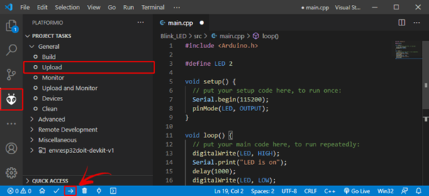

# esp32


---

## Introductie

### Hardware

Er zijn verschillende versies van de esp32 op de markt te verkrijgen. Verschillende fabrikanten hebben hun eigen versie op de markt gebracht. Het nadeel van dit aanbod is dat er naar pincompatibiliteit geen afspraken zijn gemaakt en er dus afwijkingen kunnen zijn op dat vlak tussen vershillende types esp32. 
In deze cursus wordt de focus gelegd op de Adafruit Feather HUZZAH32 ESP32 4Mb. 
Meer info is te vinden op : <https://www.adafruit.com/product/3405>

### Software

De esp32 kan via verschillende platformen worden geprogrammeerd. Het is heel populair om te doen via de Arduino IDE <https://www.arduino.cc/en/software>. Echter zullen we hier Visual Studio Code gebruiken. Visual Studio Code, vanaf nu VSC, is een IDE die voor verschillende ontwikkelingen kan worden gebruikt en wordt in de professionele wereld heel veel gebruikt. Je kan VSC gebruiken voor ontwikkelingen in verschillende talen zoals JAVA, Python, C, .... Dus hiermee ervaring krijgen heeft zeker zijn voordeel. De Arduino IDE is goed voor kleine, beperkte ontwikkelingen, voor gevorderde code (meer dan 200 lijnen code), meerdere bestanden, het gebruik van een intellisense, en andere functies biedt VSC een betere oplossing. VSC biedt voor de esp32 niet alleen de mogelijkheid om code te schrijven, maar ook om die te compileren en die te downloaden in de esp32 microcontroller zelf. Tevens bezit VSC een Serial Terminal scherm die het mogelijk maakt om tijdens de run van de esp32 serieëel te kunnen uitwisselen. Dit kan een ondersteuning zijn voor het debuggen van uw code (uiteraard kan RealTerm hier ook worden voor gebruikt). 

Een echte debug tool met breakpoints is zonder extra hardware echter niet mogelijk. <https://docs.espressif.com/projects/esp-idf/en/latest/esp32/api-guides/jtag-debugging/index.html>

## Installatie + preparatie Visual Studio Code

Installeer VSC via <https://code.visualstudio.com/download>.


Klik op de installatie wizard om de installatie te starten en volg de stappen om te vervolledigen.


Next ...


Install ...


Finish ...


Open VSC ...


Zo, VSC staat op uw computer en kan worden gebruikt.

Om binnen VSC met softwarecode te kunnen werken met de esp32 (ook minder krachtige devices zoals esp8266 kunnen worden gebruikt) moet je VSC uitbreiden met een extra Extension. Hier wordt gebruik gemaakt van PlatformIO (PIO). Installatie via <https://randomnerdtutorials.com/vs-code-platformio-ide-esp32-esp8266-arduino/>.


Open VSC en klik op het extension icoon of klik Ctrl+Shift+X om de Extension tab te openen. Zoek naar "PlatformIO IDE", selecteer en installeer (kan wel een tijdje duren).


Zorg dat na installatie de extensie is ge-enabled (bij Disable kan dit niet worden gebruikt).


Aan de linkerzijde van het scherm van VSC moet het icoontje zichtbaar zijn, en in het midden moet een Home icoon aanwezig zijn waarmee naar de Home pagina van PlatformIO kan worden verwezen.


Voila, VSC is volledig klaar. Wil je andere hardware of software ontwikkelingen doen binnen VSC, dan zal daarvoor andere Extensions aan VSC moeten worden toegevoegd. Indien er icoontjes zouden ontbreken, herstart dan VSC (het is aangewezen om VSC sowieso te herstarten na installatie en toevoeging van Extensions).

### Quick overview VSC en PIO

Verduidelijking van icoontjes en shortcuts voor :

> * File explorer
> * Search, zoeken door bestanden
> * Source code management (using gist)
> * Start (Launch) en debug code
> *	Manage extensions


Daarenboven kan met Ctrl+Shift+P of door te klikken op View > Command Palette ... kunnen alle commando's worden weergegeven. Als een commando moet worden gezocht dan kan de shortcut worden gevonden in het Command Palette (zoek daarbinnen).

Onderaan VSC wordt een blauwe incoon bar weergegeven die belangrijk is in het gebruik met de esp32.


Met volgende mogelijkheden (van links naar rechts): PlatformIO Home | Build/Compile | 

> * PlatformIO Home
> * Build/Compile
> * Upload
> * Clean
> *	Serial Monitor
> *	New Terminal

Door te hoveren met de muis over deze iconen, wordt extra info weergegeven. Er kan ook geklikt worden op het PIO icoon om alle taken te zien van het PlatformIO.


Bij problemen bij de weergave, dan kan er geklikt worden op de 3-puntjes icoon om de PlatformIO Tasks te selecteren.


## Platform IDE Overview

Om nu met het geheel te werk te gaan (schrijven van code, compileren en uploaden naar de microcontroller) wordt nu vertrokken vanuit een klassiek voorbeeld om tot een knipperende LED te komen (blinking LED).

## Create a New Project

in VSC, klik op het icoon van PIO en klik op New Project om een nieuw project te starten:


Geef het project een goeie naam: vb. : "Blink_LED" en selecteer de juiste microcontroller board. Het Arduino Framework wordt gebruikt om de Arduino-code te compileren naar binaire code die in de esp32 microcontroller kan worden geprogrammeerd.

Let op de locatie van uw project binnen de mappenstructuur van uw computer. Gebruik hiervoor logische sructuren zodat je later uw projecten kan terug vinden!!

De standaard locatie staat nu ingesteld op het pad : Documents >PlatformIO >Projects 


Klik "Finish".

Er wordt een nieuw project toegevoegd aan de Workspace. Open platformio.ini en voeg toe:


VS Code en PlatformIO hebben een mappenstructuur die verschilt van het standaard .ino-project. Als u op het tabblad Verkenner klikt, ziet u alle bestanden die het heeft gemaakt in uw projectmap. Het lijkt misschien veel bestanden om mee te werken. Maar maak je geen zorgen, meestal hoef je alleen maar met een of twee van die bestanden om te gaan.

> **Warning**
> Let op, je verwijdert, wijzigt of verplaatst best die bestanden niet. Anders kunt u uw project niet meer compileren met PlatformIO.

**platformio.ini file**

Het platformio.ini-bestand is het PlatformIO-configuratiebestand voor uw project. Het toont het platform, het bord en het raamwerk (framework) voor uw project. U kunt ook andere configuraties toevoegen, zoals bibliotheken die moeten worden opgenomen, uploadopties, het wijzigen van de baudrate van de seriële monitor en andere configuraties.


Met volgende:

> * platform: welke gebruikte microcontroller (SoC).
> * board: het type ontwikkel-board
> * framework: het software ontwikkel platform die de code zal compileren

Voor de ESP32 en ESP8266, wordt de gebruikte datasnelheid voor de seriëele communicatie ingesteld op een baud rate van 115200. Dit doe je door de platformio.ini file (zoals volgnde figuur) aan te passen (Klik na aanpassen op Ctrl+S om wijziging op te slaan). In dit bestand kun je ook de identifier opnemen van bibliotheken die je in je project gaat gebruiken met behulp van de lib_deps-richtlijn.

**src folder**

De src-map is uw werkmap. Onder de src-map bevindt zich een main.cpp-bestand. Daar schrijf je je code. Klik op dat bestand. De structuur van een Arduino-programma zou moeten openen met de functies setup() en loop().


In PlatformIO moeten alle Arduino sketches (een project wordt in de Arduino een sketch genoemd) bovenaan in de code straten met het aanroepen van de Arduino bibliotheek door volgend statement **#include <Arduino.h>**.

## Uploading Code met PlatformIO IDE: ESP32/ESP8266

Schrijf volgende code in de main.cpp

```cpp
#include <Arduino.h>

#define LED 13

void setup() {
  // put your setup code here, to run once:
  Serial.begin(115200);
  pinMode(LED, OUTPUT);
}

void loop() {
  // put your main code here, to run repeatedly:
  digitalWrite(LED, HIGH);
  Serial.println("LED is on");
  delay(1000);
  digitalWrite(LED, LOW);
  Serial.println("LED is off");
  delay(1000);
}
```

Nu kunt u op het pictogram Uploaden klikken om de code te compileren en te uploaden. U kunt ook naar het menu PIO-projecttaken gaan en Uploaden selecteren.



Als de code successvol is geuploaded, dan wordt volgend bericht weergegeven.


Klik nu op het pictogram van de seriële monitor en u zou de huidige LED-status moeten zien afdrukken.


## Installing ESP32/ESP8266 Libraries on PlatformIO IDE

Een standaard project (sketch) kan worden uitgebreid met library's. Die library's zijn stukken code die bepaalde functies toelaten om in de code te gebruiken. Voor veel externe hardware ( sensoren / actuatoren) die kan gekoppeld worden aan de microcontroller kan een library worden gevonden op het internet. Hier wordt besproken om een sensor, die temperatuur en vochtigheid kan meten, toe te voegen aan het bestaand project. Het type sensor is BME280.

Zoek een library voor deze sensor : "Adafruit_BME280"


Klik op de library die je wil toevoegen aan het project: klik Add to Project.


Selecteer het project waar de library moet worden toegevoegd:


Hiermee wordt de bibliotheek identifier toegevoegd met behulp van de lid_deps-richtlijn in het platformio.ini-bestand. Als u het platformio.ini-bestand van uw project opent, zou het eruit moeten zien zoals in de volgende afbeelding.


Als alternatief kunt u in het bibliotheekvenster, als u het tabblad Installatie selecteert en een beetje scrolt, de id voor de bibliotheek zien. U kunt elk van deze ID's kiezen, afhankelijk van de opties die u wilt gebruiken. De bibliotheek-ID's zijn rood gemarkeerd.


Ga vervolgens naar het platformio.ini-bestand van uw project en plak de bibliotheek-ID in dat bestand, zoals dit:

```cpp
lib_deps = adafruit/Adafruit BME280 Library@^2.1.0
```

Als je meerdere bibliotheken nodig hebt, kun je hun naam scheiden door een komma of ze op verschillende regels zetten. Bijvoorbeeld:

```cpp
lib_deps = 
arduino-libraries/Arduino_JSON @ 0.1.0 
adafruit/Adafruit BME280 Library @ ^2.1.0 
adafruit/Adafruit Unified Sensor @ ^1.1.4
```

PlatformIO heeft een ingebouwde krachtige bibliotheekmanager, waarmee u aangepaste afhankelijkheden per project kunt specificeren in het projectconfiguratiebestand platformio.ini met behulp van lib_deps. Dit zal PlatformIO vertellen om automatisch de bibliotheek en al zijn afhankelijkheden te downloaden wanneer u het configuratiebestand opslaat of wanneer u uw project compileert.

## Pin layout van de esp32


Een van de geweldige dingen van de ESP32 is dat hij tonnen meer GPIO heeft dan de ESP8266. U hoeft niet te jongleren of te multiplexen met uw IO-pinnen! Er zijn een paar dingen om op te letten, dus lees de pin-outs zorgvuldig door.


Met de onderkant : 


### Power pins


> * **GND** - dit is de gemeenschappelijke nul-volt (referentie) voor alle voeding en logica.
> * **BAT** - dit is de positieve spanning van/naar de JST-aansluiting voor de optionele Lipoly-batterij.
> * **USB** - dit is de positieve spanning van/naar de micro-USB-aansluiting indien aangesloten.
> * **EN** - dit is de activeringspin van de 3.3V-regelaar. Het is omhoog getrokken (pulled-up), dus maak verbinding met aarde om de 3.3V-regelaar uit te schakelen.
> * **3V** - dit is de output van de 3.3V-regelaar. De regelaar kan een piek van 500 mA leveren, maar de helft daarvan wordt getrokken door de ESP32, en het is een behoorlijk stroomverslindende chip. Dus als je veel stroom nodig hebt voor dingen zoals LED's, motoren, enz. Gebruik dan de USB- of BAT-pinnen en een extra regelaar.

### Logische (digitale) pinnen : GPIO

Dit is de algemene I/O-pinset voor de microcontroller. Alle logica is 3.3V!!

> **Warning**
> De ESP32 werkt op 3,3V  : tenzij anders aangegeven, zijn GPIO-pinnen niet 5V veilig (no 5V tolerant)!.

### Serial pins

RX en TX zijn de extra Serial-pinnen en zijn niet aangesloten op de USB/Serial-converter. Dat betekent dat je ze kunt gebruiken om verbinding te maken met UART-apparaten zoals GPS's, vingerafdruksensoren, enz.


De TX-pin is de uitgang van de module. De RX-pin is de ingang in de module. Beide zijn 3.3V logica.

### I²C & SPI pins

Je kunt de ESP32 gebruiken om I2C- en SPI-apparaten, sensoren, uitgangen, enz. te besturen. Bij gebruik met Arduino werken de standaard Wire- en SPI-apparaten zoals je zou verwachten!


Merk op dat de I2C-pinnen nog geen pullup-weerstanden hebben! Je moet ze toevoegen als je wilt communiceren met een I2C-apparaat.

### GPIO & analoge pins


Er zijn talloze GPIO- en analoge ingangen beschikbaar voor het aansluiten van LED's, knoppen, schakelaars, sensoren, enz. Hiervoor zijn de resterende pinnen beschikbaar.

Bottom row:
> * **A0** - dit is een analoge ingang A0 en ook een analoge uitgang DAC2. Het kan ook worden gebruikt als een GPIO #26. Het gebruikt ADC #2.
> * **A1** - dit is een analoge ingang A1 en ook een analoge uitgang DAC1. Het kan ook worden gebruikt als een GPIO #25. Het gebruikt ADC #2.
> * **A2** - dit is een analoge ingang A2. Het kan ook worden gebruikt als een GPI #34. Het gebruikt ADC #1. Deze pin kan GEEN Output zijn.
> * **A3** - dit is een analoge ingang A3. Het kan ook worden gebruikt als een GPI #39. Het gebruikt ADC #1. Deze pin kan GEEN Output zijn.
> * **A4** - dit is een analoge ingang A4. Het kan ook worden gebruikt als een GPI #36. Het gebruikt ADC #1. Deze pin kan GEEN Output zijn.
> * **A5** - dit is een analoge ingang A5. Het kan ook worden gebruikt als een GPIO #4. Het gebruikt ADC #2.
> * **21** - dit is een GPIO #21.  


Top row:
> * **13** - dit is een analoge ingang A12. Het kan ook worden gebruikt als een GPIO #13. Het gebruikt ADC #2. Deze pin is ook verbonden met de rode LED naast de USB connector.
> * **12** - dit is een analoge ingang A11. Het kan ook worden gebruikt als een GPIO #12. Het gebruikt ADC #2. Deze pin bezit inwendig een pull-down weerstand. Er wordt geadviseerd om deze pin enkel te gebruiken als Output of er zeker van te zijn dat tijdens het boot-proces de pull-down geen afeect veroorzaakt.
> * **27** - dit is een analoge ingang A10. Het kan ook worden gebruikt als een GPIO #27. Het gebruikt ADC #2. 
> * **33** - dit is een analoge ingang A9. Het kan ook worden gebruikt als een GPIO #33. Het gebruikt ADC #1. Het kan ook gebruikt worden als aansluiting van een 32Khz kristaloscillator.
> * **15** - dit is een analoge ingang A8. Het kan ook worden gebruikt als een GPIO #15. Het gebruikt ADC #2.
> * **32** - dit is een analoge ingang A7. Het kan ook worden gebruikt als een GPIO #32. Het gebruikt ADC #1. Het kan ook gebruikt worden als aansluiting van een 32Khz kristaloscillator.
> * **14** - dit is een analoge ingang A6. Het kan ook worden gebruikt als een GPIO #14. Het gebruikt ADC #2. 

Er is nog een externe analoge input:

> * **A13** - dit is een GPI #35 en kan gebruikt worden als analoge input A13. Deze pin bevat een weerstandsdeling die is aangesloten op de VBAT lijn. Op die manier kan de toestand van de batterij worden ingelezen op deze pin.

> **Warning**
> Houd er rekening mee dat u alleen analoge ingangen op ADC #2 kunt lezen zodra WiFi is gestart, omdat deze wordt gedeeld met de WiFi-module.

## Power Management


De esp32 kan op verschillende manieren worden voorzien van spanning (voeding). 

**Battery + USB Power**

We wilden de Feather HUZZAH32 gemakkelijk van stroom voorzien, zowel bij aansluiting op een computer als via een batterij. Er zijn **twee manieren** om een Feather van stroom te voorzien. U kunt verbinding maken met een micro-USB-kabel (gewoon in de aansluiting steken) en de Feather regelt de 5V USB tot 3,3V met een interne spanningsregelaar. U kunt ook een 4.2/3.7V Lithium Polymer (Lipo/Lipoly) of Lithium Ion (LiIon) batterij aansluiten op de JST jack. Hierdoor werkt de Feather op een oplaadbare batterij. Wanneer de USB-voeding is ingeschakeld, schakelt deze automatisch over naar USB voor voeding en begint de batterij (indien aangesloten) op 200 mA op te laden. Dit gebeurt in 'hot-swap'-stijl, zodat u de LiPoly altijd aangesloten kunt houden als een 'back-up'-stroom die alleen wordt gebruikt als de USB-stroom uitvalt.

> **Warning**
> De polariteit van de JST-connector is afgestemd op Adafruit LiPoly-batterijen. Het gebruik van batterijen met de verkeerde polariteit kan je Feather kapot maken.


Het bovenstaande toont de Micro USB-aansluiting (links), Lipoly JST-aansluiting (linksboven), evenals de 3.3V-regelaar (rechts van de JST-aansluiting), omschakeldiode + transistor (onder de JST-aansluiting) en de Lipoly-oplaadpoort circuit (direct onder de regelaar).

Er is ook een CHG-LED naast de USB-aansluiting, die oplicht terwijl de batterij wordt opgeladen. Deze LED kan ook flikkeren als de batterij niet is aangesloten, dit is normaal.

**Power supplies**

Je hebt hier heel wat voedingsopties! We beginnen met de BAT-pin, die is verbonden met de lipoly JST-connector, evenals USB, de +5V van USB indien aangesloten. We hebben ook de 3V-pin die verbonden is met de output van de 3.3V-regelaar. We gebruiken een 500mA piek low-dropout regelaar. Beperk extern stroomverbruik tot 250mA (WROOM32-module consumeert ook 250mA). Hoewel u er in totaal 500 mA uit kunt halen, kunt u dit niet continu doen vanaf 5V, omdat dit de regelaar oververhit. We gebruiken dit om de ESP32 van stroom te voorzien, die continu ongeveer 200 mA trekt. Het goede nieuws is dat je de ESP32 veel gemakkelijker in de slaap- en energiebesparende modus kunt zetten.


**Measuring battery, meten van de batterijspanning**

Als je geen batterij meer hebt, is de kans groot dat je wilt weten wat de spanning is! Zo weet je wanneer de batterij moet worden opgeladen. Lipoly-batterijen zijn 'maximaal' bij 4,2 V en blijven ongeveer 3,7 V gedurende een groot deel van de levensduur van de batterij, en zakken dan langzaam naar 3,2 V voordat het beveiligingscircuit het afsnijdt. Door de spanning te meten, kunt u snel zien wanneer de batterij onder de 3,7 V zakt.

Omdat de ESP32 tonnen ADC-pinnen heeft, 'offeren' we er een voor LiPoly-batterijbewaking. Je kunt de helft van de accuspanning aflezen van A13. Vergeet niet de afgelezen spanning te verdubbelen, er is namelijk een deler.

**Enable pin**

Als u de 3.3V-regelaar wilt uitschakelen, kunt u dat doen met de EN(able) pin. Bind deze pin eenvoudig aan de grond en het zal de 3V-regelaar uitschakelen. De BAT- en USB-pinnen worden nog steeds van stroom voorzien.
Hierdoor worden de ESP32-processor en alle ingebouwde circuits uitgeschakeld, behalve de USB-seriële converter.


**Alternative Power Options**

De twee belangrijkste manieren om het bordje van stroom te voorzien, zijn een LiPo-batterij van 3,7 / 4,2 V die is aangesloten op de JST-poort of een USB-voedingskabel.

Als je andere manieren nodig hebt om het bordje van stroom te voorzien, wordt volgende geadviseerd :

> Voor permanente installaties kunt u met een 5V 1A USB-wandadapter een USB-kabel aansluiten voor betrouwbare stroom
> Gebruik voor mobiel gebruik, waar u geen LiPoly wilt, een USB-batterijpakket!
> Als je een voeding met een hogere spanning hebt, gebruik dan een 5V buck-converter en sluit deze aan op de 5V- en GND-ingang van een USB-kabel

Volgende mag je NIET doen :

> Gebruik geen alkaline- of NiMH-batterijen en sluit deze aan op de batterijpoort - dit zal de LiPoly-oplader vernietigen en er is geen manier om de oplader uit te schakelen
> Gebruik geen 7.4V RC-batterijen op de batterijpoort - dit zal het bord vernietigen

De esp32-Feather is niet ontworpen voor externe voedingen - dit is een ontwerpbeslissing om het bord compact en goedkoop te maken. Het wordt niet aanbevolen, maar technisch mogelijk om :

> Sluit een externe 3.3V voeding aan op de 3V en GND pinnen. Niet aanbevolen, dit kan onverwacht gedrag veroorzaken en de EN-pin werkt niet meer. Dit levert ook geen stroom op BAT of USB en sommige Feathers/Wings gebruiken die pinnen voor hoge stroomverbruiken. Je kunt je Feather uiteindelijk beschadigen.
> Sluit een externe 5V-voeding aan op de USB- en GND-pinnen. Niet aanbevolen, dit kan onverwacht gedrag veroorzaken bij het aansluiten van de USB-poort, omdat u de USB-poort weer van stroom voorziet, wat uw computer kan verwarren of beschadigen.

## PWM

De ESP32 LED PWM-controller heeft 16 onafhankelijke kanalen die kunnen worden geconfigureerd om PWM-signalen met verschillende eigenschappen te genereren. Alle pinnen die als uitgangen kunnen dienen, kunnen worden gebruikt als PWM-pinnen (GPIO's 34 tot 39 kunnen geen PWM genereren). Hiervoor kan de AnalogWrite (Arduino) worden gebruikt of het ledc-statement (bezit meer mogelijkheden dan analogWrite).

## extra info  

<https://randomnerdtutorials.com/esp32-pwm-arduino-ide/>

Veel succes.
