# Hands on AI in STEM

## Intro

Hier zal gebruik gemaakt worden van AI om een servomotor op de micro:bit aan te sturen. Er zal eerst een neuraal netwerk getraind worden met beelden. Beelden die we verzamelen via de webcam van de computer. Hoe meer beelden we nemen, hoe preciezer het neuraal netwerk zal werken. Binnen het neuraal netwerk (NN) zullen we een aantal klasse's opnemen (classificatie). Hoeveel klasses je nodig hebt hangt af van de toepassing. De aangeboden train beelden zullen we zelf toekennen aan een klasse. We werken hier dus met een **Supervised learning AI model** werken. De data geven we aan het NN en bij die data zeggen we (per beeld hier) het NN tot welk een klasse de data behoort. 

Het neuraal netwerk (NN) zal patronen zoeken en onderscheiden die specifiek zijn voor een bepaalde klasse.

Eenmaal het neuraal netwerk getraind is kunnen we dan een nieuw beeld aanbieden aan het NN die dan een beoordeling zal maken en een procentuele kanswaarde zal genereren voor iedere klasse. De hoogste procentuele waarde zal bepalend zijn om het beeld tot die klasse onder te brengen. Let wel het nieuwe beeld levert geen meerwaarde aan het leerproces van het NN. Indien er geen voldoening is door de gebruiker dringt zich een nieuwe leerfase op met betere/meer traindata. 

> Het is dus duidelijk dat we zelf het NN niet zullen bouwen, maar we gebruiken een leeg bestaand NN om met onze specifieke data dit NN te trainen volgens onze toepassing. Wil je een nieuwe toepassing, dan kan je dit opnieuw doen met andere data.

Eenmaal we tevreden zijn van het getrainde NN (we zullen het ook testen, wat ook een belangrijke stap is in het gebruik van AI) gaan we dit volledige NN downloaden als een bestand op onze computer. Aan dit bestand kunnen we dan nieuwe data aanbieden, waarop het NN dan zijn werk zal doen en een output (procentuele classificatie).

Om dit te kunnen doen zullen we een beetje moeten programmeren. En python is hiervoor uitstekend geschikt. In dit programma zullen we toelaten dat we nieuwe data kunnen binnenhalen (in ons geval webcam beelden) en dat we die nieuwe data kunnen aanbieden aan het bestand met daarin ons getraind NN. Dit zal dus een output generen volgens de klasses die we in het NN hebben opgenomen. Daaruit zullen we de klasse halen die de hoogste 'confidence score' bezit. 

Ons python programma zal dan ook in staat moeten zijn om te kunnen communiceren met de microcontroller. In ons geval de micro:bit. Het python programma kan dan een unieke waarde doorsturen naar de microcontroller. De microcontroller kan die waarde binnen lezen en interpreteren. Volgens de interpretatie kan de microcontroller dan een actuator aansturen, in ons geval de positie van een servomotor.


## Stappenplan

Om een overzicht te houden volgt hier een opsomming van de te nemen stappen:
<ol>
<li>beelden verzamelen om het NN te trainen = train data (via webcam)</li>
<li>beelden classificeren</li>
<li>NN trainen</li>
<li>NN downloaden als bestand</li>
<li>python script schrijven met volgende mogelijkheden: </li>
<ol>
    <li>NN bestand importeren en gebruiken</li>
    <li>nieuwe webcam beelden kan aanleveren aan NN</li>
    <li>output van NN kan lezen en interpreteren</li>
    <li>communiceren met een microcontroller</li>
    <li>output van NN doorsturen naar microcontroller</li>
</ol>
<li>microcontroller leest data binnen</li>
<li>microcontroller stuurt actuator aan</li>
</ol>

We bespreken in volgende hoofdstukken deze stappen in detail. We gaan hier een voorbeeld uitwerken waarbij we met 3 klasses zullen werken:

<ul>
<li>klasse1 : beelden met een duim omhoog</li>
<li>klasse2 : beelden met een duim omlaag</li>
<li>klasse0 : beelden zonder zichtbare duim (of iets die niet klasse1 en niet klasse2 is)</li>
</ul>

Op basis van die beelden (classificaties) willen we de positie van een servo motor aansturen in drie posities: 

<ul>
<li>klasse1 : positie servo motor uiterst links</li>
<li>klasse2 : positie servo motor uiterst rechts</li>
<li>klasse0 : positie servo motor in het midden</li>
</ul>

<hr>

## Beelden verzamelen om het NN te trainen = train data (via webcam)

Hiervoor gebruiken we een online platform van Google. Dit platform voorziet lege neurale netwerken die je met uw eigen data kan trainen. Nadien kan je ook testen of uw NN geschikt is voor gebruik. Het platform is 'Teachable Machine' en is te vinden op:

<https://teachablemachine.withgoogle.com/>

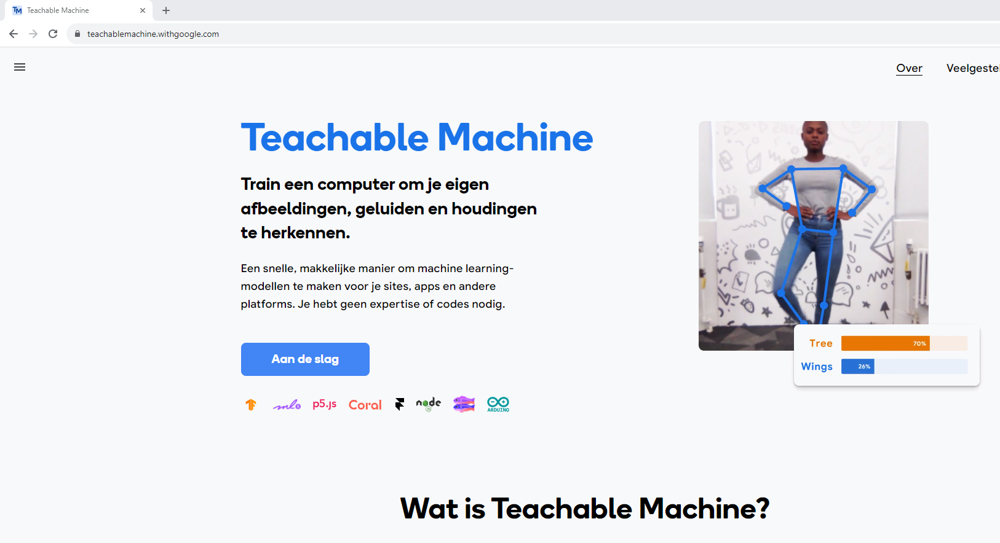

Je hebt hiervoor een Google-account nodig. Log met die account in op 'Teachable Machine'. Nu kan je kiezen wat voor soort train-, test- en verwerk data je wenst te gebruiken. 

Klik op de knop "Aan de slag"


## Beelden classificeren

De gemaakte beelden zijn onmiddelijk in drie klasses gestopt volgens inhoud van de foto's:

<ul>
<li>klasse1 : beelden met een duim omhoog</li>
<li>klasse2 : beelden met een duim omlaag</li>
<li>klasse0 : beelden zonder zichtbare duim (of iets die niet klasse1 en niet klasse2 is)</li>
</ul>


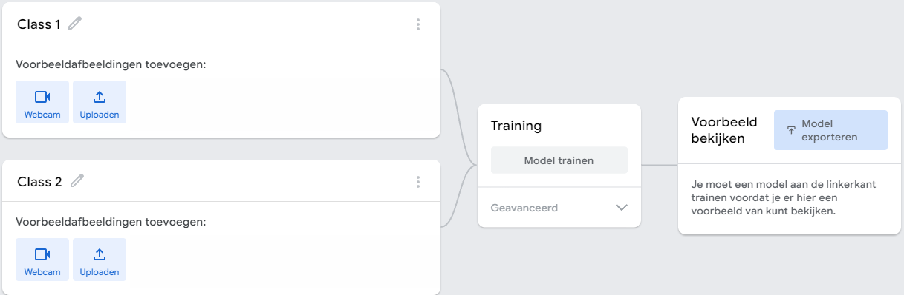


## Neuraal netwerk trainen

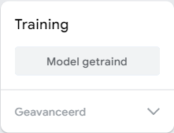

Na het train proces kan er op de website onmidellijk worden getest met nieuwe data (nieuwe beelden). Ga hier na of in alle omstandigheden het neuraal netwerk goed reageert en classificeert. Indien dit niet ok is kan er opnieuw worden getraind met nieuwe / extra data. 

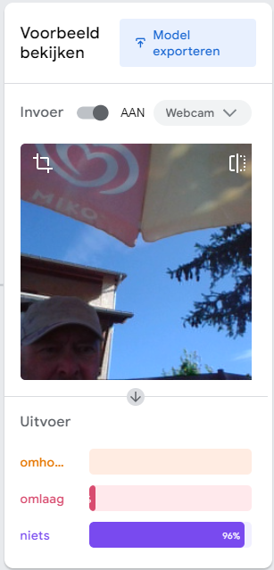

Eenmaal dit goed bevonden, kan dit worden opgeslagen in uw Google account. Dit is handig als er achteraf toch nog nieuwe trainingsdata zou moeten bijkomen. Je kan verschillende van die getrainde NN op de website opslaan.


## Volledig getraind Neuraal Netwerk downloaden als bestand

Het volledige getraind neuraal netwerk kan nu als bestand worden gedownload. Let wel, niet alle getrainde fotodata is hierin opgeslagen. Wel de herkende patronen die het NN toelaten om er een classificatie van te maken. Vandaar dat dit bestand niet zo groot is als je op eerste zicht zou verwachten.

Klik op Model exporteren

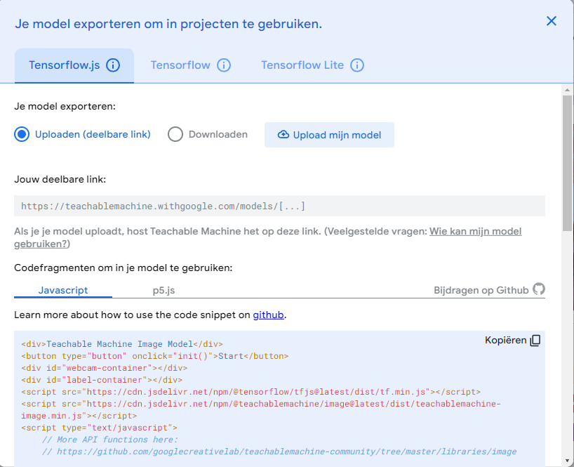

Er zijn verschillende manieren om van dit NN een bestand te maken. Het Google model die hier gebruikt wordt is een Keras model van Tensorflow. Tensorflow is een Google onderdeel die zich specialiseert in AI. Op de website kunnen we dit NN als een keras model van Tensorflow downloaden. 

Klik hiervoor op het middelste tabblad "Tensorflow" en zet de radiobutton op Keras.

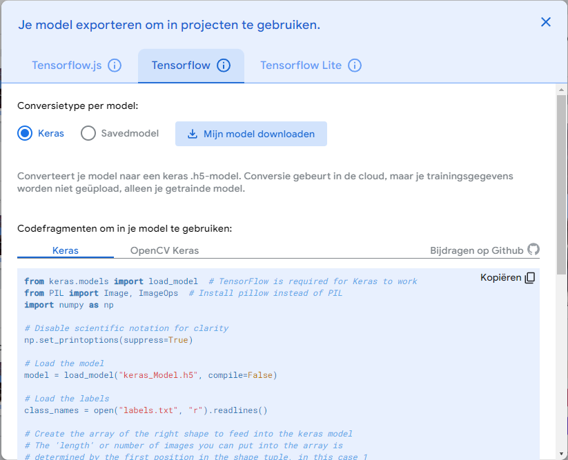

Klik nu op de knop "Mijn model downloaden". Teachable Machine zal het model converteren naar een Keras model en het inpakken in een ZIP bestand.

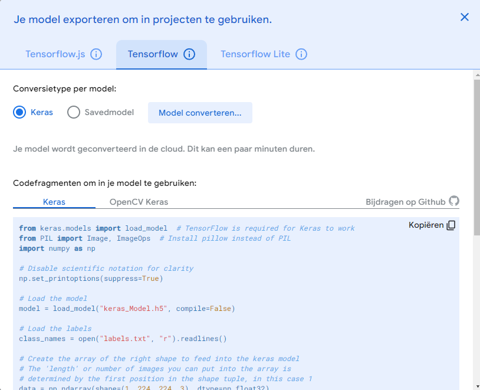

Dit levert een ZIP bestand (converted_keras.zip) op dat je op uw lokale computer kan bewaren en uitpakken.


In het ZIP bestand zitten twee bestanden:


Het ene bestand is het NN 'keras_model.h5' bestand. Het volledige getrainde NN zit vervat in dit bestand.
Het andere bestand "labels.txt" bevat enkel de namen van de klasses.


## Python script schrijven

Nu moet er op de lokale computer een Python script wordt geschreven die volgende zaken doet:

<ol>
    <li>NN bestand importeren en gebruiken</li>
    <li>nieuwe webcam beelden kan aanleveren aan NN</li>
    <li>output van NN kan lezen en interpreteren</li>
    <li>communiceren met een microcontroller</li>
    <li>output van NN doorsturen naar microcontroller</li>
</ol>

Hiervoor wordt best gebruik gemaakt van een Python IDE (ontwikkelomgeving). Er wordt hier gebruik gemaakt van Spyder. Dit wordt best geïnstalleerd onder het pakket van Anaconda.

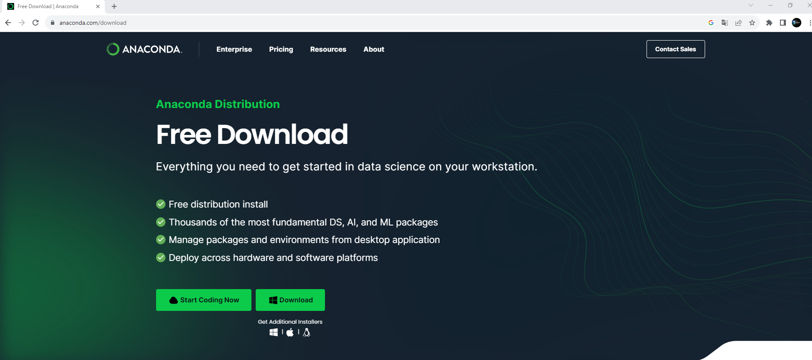

Ga naar de website van Anaconda en download de installer van Anaconda. Na het downloaden voer de installer uit:

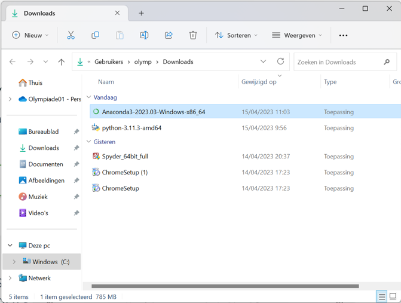

Volg daarna standaard stappen (§zorg dat je Adminuisrator rechten hebt op de computer!!):

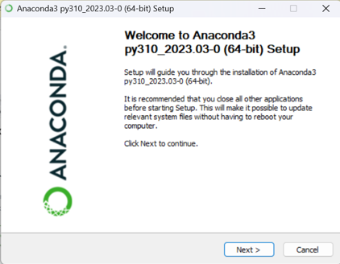

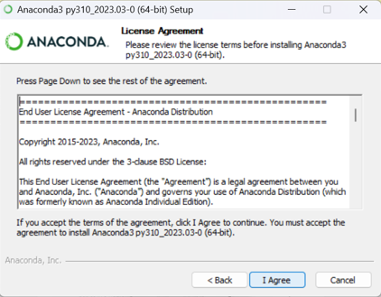

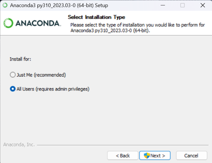

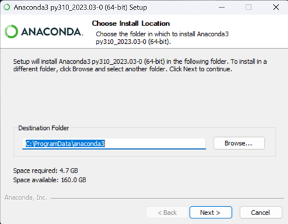

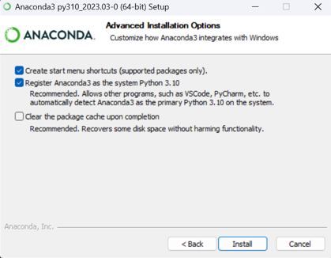

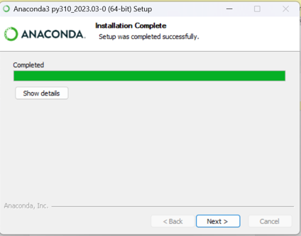

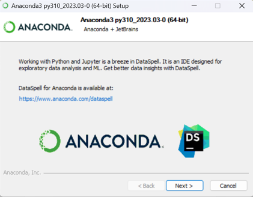

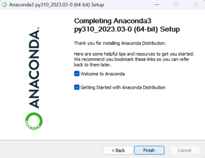

Reboot de computer

Start Anaconda Navigator

Select Spyder en Launch

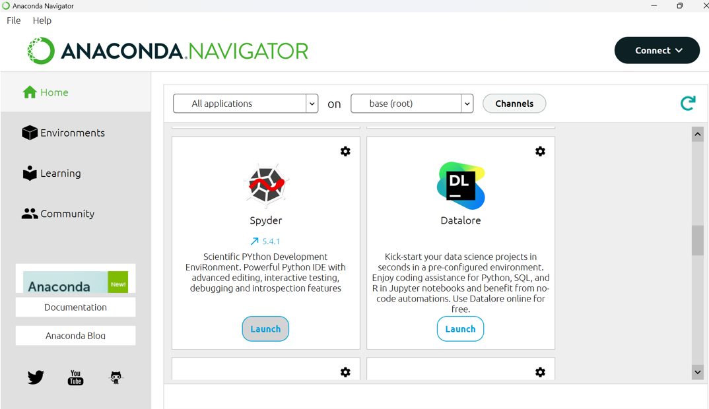

Sluit Spyder en Anaconda volledige af en start de Navigator opnieuw met Administrator rechten!!!

### Installatie van OpenCV voor Anaconda

OpenCV is een Python bibliotheek die het programma in staat stelt om de webcam van de computer te gebruiken. Dit is trouwens nodig om nieuwe beelden te kunnen aanbieden aan het NN.

Start CMD.exe Prompt binnen Anaconda op:


 En voer het volgende commanda op de prompt uit:

```prompt
 conda install -c conda-forge opencv
```

 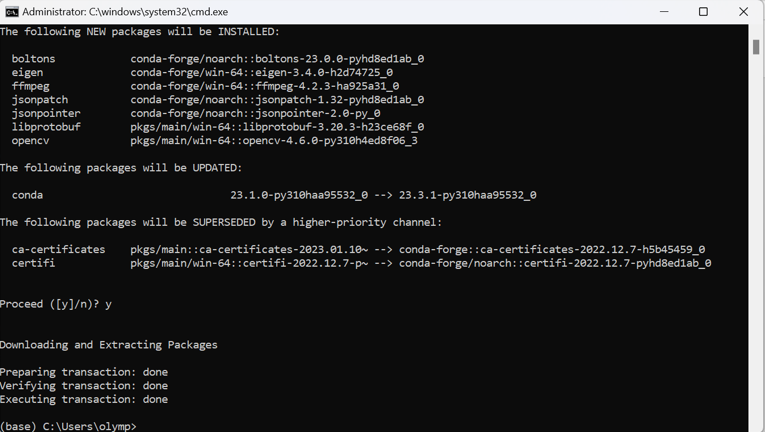

 ### Install Tensorflow in Anaconda

 Om een Keras model van Tensorflow te kunnen gebruiken moet ook hiervoor een bibliotheek op de computer worden geïnstalleerd. Doe dit ook in de CMD.exe Prompt binnen Anaconda navigator (opnieuw met administrator rechten) :

```prompt
 conda create -n tf tensorflow
```


Bevestig met 'y'


Activeer deze bibliotheken met het commando:


```prompt
 conda activate tf
```


Voila, de computer is klaar om een python script, met daarin het gebruik van een Keras Tensorflow AI Neuraal Netwerk bestand en via Opencv kan het script de webcam gebruiken, te schrijven en te testen.

## Python script zonder micro:bit

De werking van OpenCV en het neuraal netwerk kan getest worden adhv volgend script. Start binnen Anaconda Navigator de Spyder IDE op. Spyder is een python editor waarbinnen python code kan worden geschreven.

Het is hier niet de bedoeling om qua python kennis alles uit de doeken te doen. Een zeer beperkte bespreking van de werking van het script zal hier worden uitgevoerd. Bij verdere interesse in de werking van python en spyder wordt hier verwezen naar aparte opleiding hieromtrent.

Zorg in eerste instantie dat je een aparte map hebt gemaakt op uw computer waar alle bestanden omtrent dit script in zullen worden verzameld. Hierin komt al zeker de twee bestanden die je uit het ZIP bestand hebt gehaald ("labels.txt", "keras_model.h5"). Zorg er ook voor dat het nieuwe aangemaakte py-bestand binnen Spyder ook in die map wordt bewaard.

Geef het py-bestand een eigen naam en sla op.

```python
from keras.models import load_model  # TensorFlow is required for Keras to work
import cv2  # Install opencv-python
import numpy as np

# Disable scientific notation for clarity
np.set_printoptions(suppress=True)

# Load the model
model = load_model("keras_Model.h5", compile=False)

# Load the labels
class_names = open("labels.txt", "r").readlines()

# CAMERA can be 0 or 1 based on default camera of your computer
camera = cv2.VideoCapture(0)

while True:
    # Grab the webcamera's image.
    ret, image = camera.read()
    
    # Necessary to avoid conflict between left and right
    image = cv2.flip(image,1)

    # Resize the raw image into (224-height,224-width) pixels
    image = cv2.resize(image, (224, 224), interpolation=cv2.INTER_AREA)

    # Show the image in a window
    cv2.imshow("Webcam Image", image)

    # Make the image a numpy array and reshape it to the models input shape.
    image = np.asarray(image, dtype=np.float32).reshape(1, 224, 224, 3)

    # Normalize the image array
    image = (image / 127.5) - 1

    # Predicts the model
    prediction = model.predict(image)
    print(prediction)
    index = np.argmax(prediction)
    class_name = class_names[index]
    confidence_score = prediction[0][index]

    # Print prediction and confidence score
    print("Class:", class_name[2:], end="")
    print("Confidence Score:", str(np.round(confidence_score * 100))[:-2], "%")

    # Listen to the keyboard for presses.
    keyboard_input = cv2.waitKey(1)

    # 27 is the ASCII for the ESC key on your keyboard.
    if keyboard_input == 27:
        break

camera.release()
cv2.destroyAllWindows()

```

Met dit script, die van Teachable Machine afkomstig is, kan al onmiddelijk worden getest. In de console van spyder, waar printcommando's hun visualisatie hebben, kan het resultaat geïnterpreteerd worden. Onderaan het script kan men zien dat met de toets ESC het script kan stoppen.

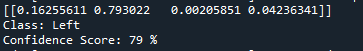

We bemerken, hier in dit voorbeeld, dat er 4 klasses zijn. Het neuraal netwerk geeft voor iedere klasse een waarde (tussen 0 en 1). De eerste klasse krijgt een score van 0,16 de twee 0,79 de derde 0,00 en de vierde 0,04. Hieruit blijkt dat het neuraal netwerk klasse 2 beschouwt als grootste kanshebber van de nieuwe data. De confidence score voor klasse2 is dus 79%. Het NN denkt voor 79% zekerheidskans dat het nieuwe beeld tot klasse2 behoort. Het NN geeft dus patronen herkent die voor 79% overeen komt met getrainde patronen voor klasse2. De naam van die klasse kan gehaald worden uit labels.txt (hier dus blijkbaar "Left").


## Python script met micro:bit

Eenmaal vorige werkt, kunnen we vanuit het python script na de predict, het resultaat doorsturen naar de micro:bit. Dit doen we door een uniek character door te sturen op basis van het predict resultaat van het NN. Afhankelijk van het aantal klasses doen we dit hier met een '0' of '1' of '2' door te sturen naar de micro:bit. Dit doen we via een serieële verbinding via de USB kabel waarmee de micro:bit is verbonden met de computer waarop het NN draait. 

Om dit te kunnen doen moeten we de COM-poort nummer kennen waarmee de micro:bit is verbonden met de computer. Dit kan telkens anders zijn!!

Dit kan je controleren via het Configuratie scherm van de computer. (Hardware en geluiden => Apparaatbeheer => Poorten (COM&LPT)).

In volgend voorbeeld is de micro:bit verbonden via COM15.

Het python script ziet er dan als volgt uit:


```python
# Import necessary modules
import numpy as np
import cv2
#from time import sleep
import tensorflow.keras
from keras.preprocessing import image
#import tensorflow as tf
#import pyautogui
import serial

teller = 0
predicted_class_old = 0

# Using laptop's webcam as source of video
cap = cv2.VideoCapture(0)

# Labels - The various possibilities
labels = ['niets','Up','Down']

# Loading the model weigths
model = tensorflow.keras.models.load_model('keras_model.h5')
ser = serial.Serial('COM15', baudrate=115200)
#s = ser.read(100)       # read up to one hundred bytes
                     # or as much is in the buffer
#ser.open()


while True:	
    success, image = cap.read()
    if success == True:
		# Necessary to avoid conflict between left and right
        image = cv2.flip(image,1)
        
        cv2.imshow("Frame",image)

		# The model takes an image of dimensions (224,224) as input so let's reshape our img to the same.
        img = cv2.resize(image,(224,224))
		
        # Convert the image to a numpy array
        img = np.array(img,dtype=np.float32)
		
        img = np.expand_dims(img,axis=0)
		
        # Normalizing
        img = img/255
		
        # Predict the class
        prediction = model.predict(img)
		
        # Map the prediction to a class name
        predicted_class = np.argmax(prediction[0], axis=-1)
        predicted_class_name = labels[predicted_class]
		
		#print(predicted_class)
        if teller >= 1:
            teller = 0
            print(str(predicted_class))
            print(type(predicted_class))
            #tekst = str.encode(predicted_class) + '\n'
            #ser.write(predicted_class)
            #ser.write(bytearray('W\r\n','ascii'))
            if predicted_class == 1:
                ser.write(bytearray('1\r\n','ascii'))
            elif predicted_class == 2:
                ser.write(bytearray('2\r\n','ascii'))
            else:
                ser.write(bytearray('0\r\n','ascii'))
                
            
            
        if predicted_class == predicted_class_old:
            teller = teller +1
        else:
            teller =0
        predicted_class_old = predicted_class
       

	# Close all windows if one second has passed and 'q' is pressed
    if cv2.waitKey(1) & 0xFF == ord('q'):
        ser.close()
        break

# Release open connections
cap.release()
cv2.destroyAllWindows()	 
```


## Micro:bit software code

Natuurlijk moet er dan nog op de micro:bit ook code draaien die deze characters kan binnenlezen en op basis daarvan een servomotor kan aansturen (theorie en praktijk, zie gedeelte micro:bit).

De code ziet er zo uit:

```python
# Imports go at the top
from microbit import *

# Servo control: 
# 50 = ~1 millisecond pulse all right 
# 75 = ~1.5 millisecond pulse center 
# 100 = ~2.0 millisecond pulse all left 
pin0.set_analog_period(20)

while True: 
    name = input()
    #display.scroll(name)
    if name == '0':
        display.clear()
        display.set_pixel(0,0,9)
        pin0.write_analog(75)
    if name == '1':
        display.clear()
        display.set_pixel(1,0,9)
        pin0.write_analog(50)
    if name == '2':
        display.clear()
        display.set_pixel(2,0,9)
        pin0.write_analog(100)
```

<hr>

Voila, dit is de volledige werking van AI Powered STEM
	

