---
mathjax:
  presets: '\def\lr#1#2#3{\left#1#2\right#3}'
---

# Micro:Bit

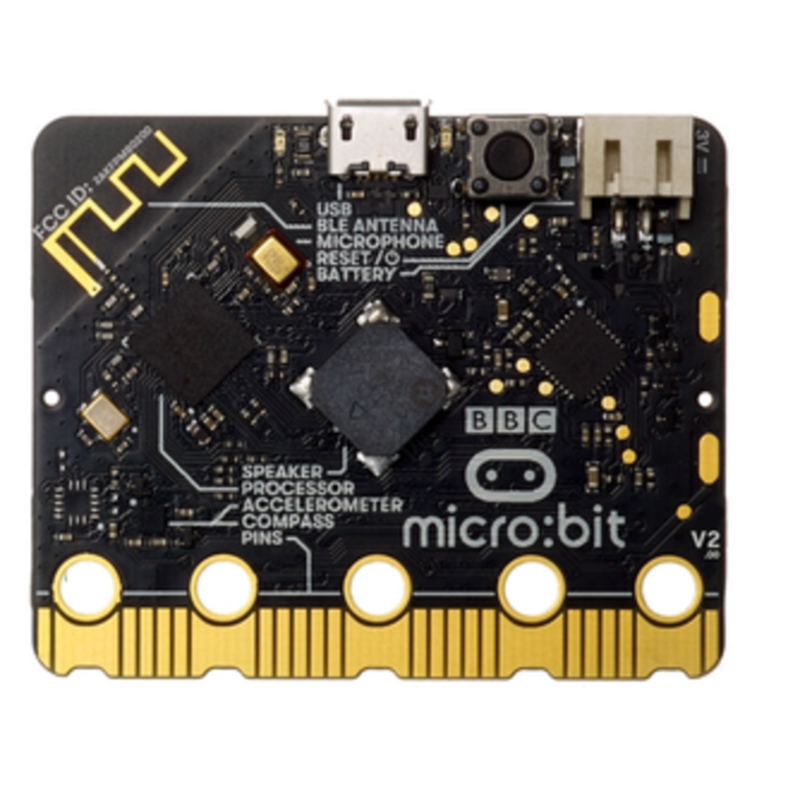

---

## Introductie

De Micro:Bit is een microcontroller zoals er vele op de markt te verkrijgen zijn zoals Arduino, Nucleo, PIC, ... Deze worden heel frequent gebruikt zowel in industriële ontwikkeling, prototyping, als bij hobby-isten. De Micro:Bit is populair door zijn lage kostprijs, zijn laagdrempelige programmeeromgeving, de aanwezigheid van vele sensoren op de Micro:Bit, de veelheid aan demo en info op het internet. 

De Micro:bit is een geweldige manier om de basisprincipes van programmeren en informatica te leren. De Microsoft MakeCode-coderingsomgeving op basis van blokken is een krachtige en intuïtieve manier om de Micro:bit te laten reageren op allerlei soorten invoer, en u kunt fundamentele concepten zoals iteraties, voorwaardelijke instructies en variabelen introduceren met MakeCode.
Studenten richten zich vaak vooral op het 5x5 LED-scherm voor het leveren van output (actuator). Hoewel dit de meest direct toegankelijke manier is om een reactie op een of andere input te zien, zijn er veel meer creatieve mogelijkheden wanneer je je leerlingen aanmoedigt om de Micro:Bit te zien als een "brein" dat fysieke, tastbare creaties kan besturen.

Deze creaties hoeven niet complex of technisch hoogstaand te zijn. Het is geweldig om studenten te laten bouwen met gemeenschappelijke huishoudelijke benodigdheden. Omdat de Micro:bit zo licht is en zoveel sensoren ondersteunt, kan hij gemakkelijk in een fysiek ontwerp worden opgenomen, zolang studenten maar vooruit plannen voor de grootte en het gewicht. Een van de eerste vragen die je studenten zou kunnen stellen, is "Waar past de Micro:Bit in je creatie?"

De Micro:Bit kan in verschillende talen worden geprogrammeerd. De meest gebruikte programmeeromgeving voor kinderen in de Microsoft MakeCode editor. Met deze omgeving kan er online worden geprogrammeerd in 4 verschillende talen: Grafische blokken, MakeCode JavaScript, MakeCode Python. Wij zullen hier echter als initiatie hier de MicroPython gebruiken. Dit heeft het voordeel dat de gebruiker leert omgaan met de syntax van Python. In deze omgeving wordt een soort operating systeem geïnstalleerd op de Micro:Bit die volledig kan bestuurd worden met de standaard Python taal. 


## Activity: De programmeeromgeving

Er bestaan verschillende manieren om de Micro:Bit in de Python programmeertaal te programmeren. Dit kan via Visual Studio Code, dit moet je dan zelf downloaden en installeren op uw computer, maar er bestaat ook een online omgeving voor MicroPython voor de Micro:Bit. Op die manier hoef je niets te installeren op uw computer. Ga hiervoor naar de website : https://microbit.org/ en klik bovenaan op "Let's code" en kies op die pagina voor de link : Python editor.

Python programmeeromgeving.")

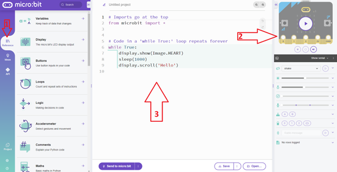

Herken hierop:
<ol>
  <li>Reference : Python bibliotheek</li>
  <li>Simulator</li>
  <li>Programmeer Python code zone</li>
</ol>

## Eerste keer connectie tussen Micro:Bit en de computer

De Micro:Bit wordt via een USB-kabel verbonden met de computer. Op die computer wordt de software ontwikkelomgeving opgestart en wordt de logica van het programma geschreven. Om het programma erin te laden wordt de micro:bit verbonden met de PC of laptop waarmee het
programma geschreven is. Dit gebeurt met een USB-kabel. Aan de zijde van de micro:bit is het een
USB-micro verbinding.


Stappenplan voor de pairing en connectie (moet maar 1 keer gebeuren): Klik op de drie bolletjes naast de knop: "Stuur naar micro:bit" en klik op "Verbinden"

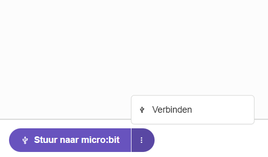
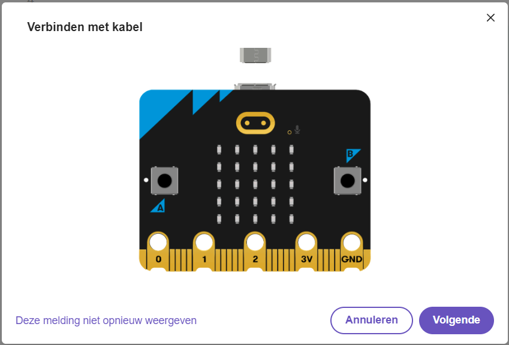
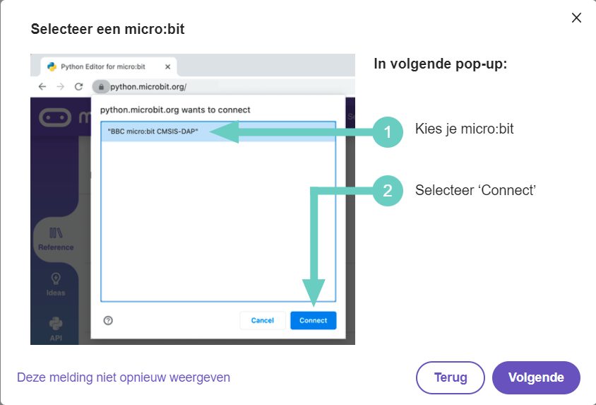
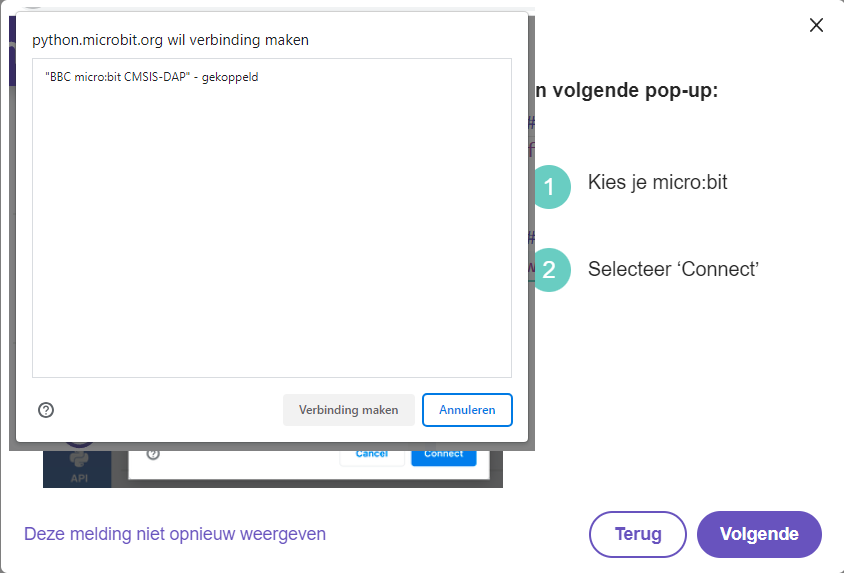
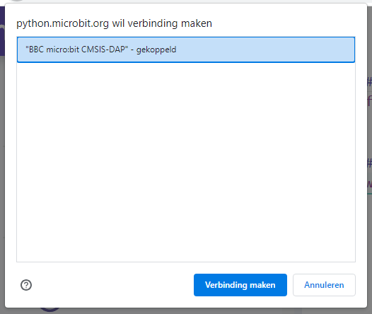

Nadien is het voldoende om de knop: "Stuur naar micro:bit" te gebruiken om de geprogrammeerde code in de Micro:Bit te programmeren en die door de Micro:Bit te laten uitvoeren.

## MicroPython code

**Initialisatie** : Omdat we werken met een Micro:bit moeten we dit steeds aangeven bovenaan de code.  Importeer steeds (*) om (bijna) alle (hardware)mogelijkheden van de Micro:Bit te gebruiken. Doe dit door bovenaan in de Python code te schrijven :

```python
from microbit import *
#Dan de rest van de python code
```

Binnen een programmeertaal zijn een aantal zaken belangrijk en keren steeds terug in andere programmeertalen. Dit zijn:
<ol>
  <li>Commentaar in Python begint met een #.</li>
  <li>Variabelen: reserveren van geheugenplaats om data (tijdelijk) in te bewaren</li>
  <li>Soorten variabelen : type : 
    <ul>
        <li>Getallen zonder komma: integer</li>
        <li>Getallen met komma: float</li>
        <li>Boolean: variabele die maar twee waarden kan bevatten: 1/0 of True/False </li>
        <li>String: variabele die tekst kan bevatten (groepering van characters) </li>
        <li>char: variabele die maar 1 character/symbool kan bevatten </li>
    </ul>
  </li>
  <li>Iteraties: herhalingen:
    <ul>
        <li>While Loop: herhaling die steeds wordt herhaald als voorwaarde True is (aantal loops is niet gekend)</li>
        <li>For Loop: herhaling die steeds wordt herhaald als voorwaarde True is (aantal loops is gekend)</li>
    </ul>
  </li>
  <li>Selecties: De <b>als</b> vraag. Als een variabele voldoet aan een voorwaarde dan wordt iets uitgevoerd, indien niet dan kan er iets anders worden uitgevoerd. In programmeertalen is dit meestal het IF-statement</li>
  <li>Converties of type casting: omzetting van ene type naar een ander type variabele</li>
  <li>Concatenatie van strings: samenvoegen van twee strings tot 1 string (aan elkaar kleven)</li>
  <li>Maken van eigen functies met daarbij parameters en return waarden</li>
</ol>

## Iets meer over variabelen:

Tekst die bestaat uit meerdere tekens, omsloten door enkele of dubbele aanhalingtekens wordt een **string** genoemd . (“string”) </br>
Een getal kan een **integer** zijn (geheel getal) of een **float** (een komma getal)( Let op! moet een punt zijn i.p.v. een komma)</br>
Een **boolean** is een variabele die maar twee toestanden kent: 0 of 1 , soms wel als **False** en **True** uitgedrukt.  </br>
**Variabele :** We kunnen ook iets opslaan in het geheugen van de computer (= declaratie = reservatie van geheugenplaatsen). Aantal geheugenplaatsen is afhankelijk van het type variabele (int, float, string, bool). Een variabele krijgt steeds een (logische)naam die de programmeur zelf kan kiezen.

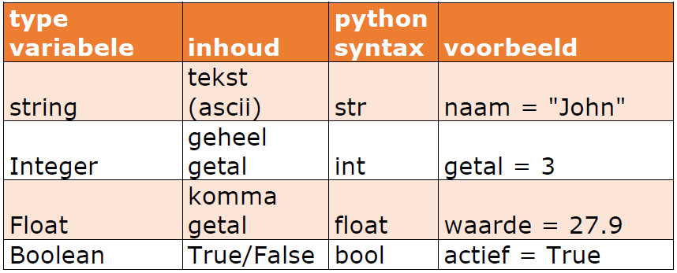

## Iets meer over iteraties:

Door Python code te schrijven kan een statement, instructie één keer worden uitgevoerd, door die code op te nemen in een While-True statement kan een oneindige herhaling worden gecreëerd waarbij dit statement telkens zal worden herhaald. (zie verder) 

## Iets meer over selecties:

Door gebruik te maken van vergelijkingsoperatoren zoals gelijkaan (==), groter dan (>), kleiner dan (<), ... kan een voorwaarde worden opgesteld om iets te doen, of iets niet te doen. Op deze logica is het digitaal programmeren gebouwd. In python code, net zoals in vele andere talen wordt hiervoor het IF-statement gebruikt. Hierbij zijn wel een aantal varianten mogelijk en kunnen er complexere voorwaarden worden geprogrammeerd door gebruik te maken van de logische operatoren. (zie verder in code voorbeelden)

## Micro:Bit specifieke MicroPython functies

Deze functies hebben specifieke betrekking tot de onboard sensoren en actuatoren.

### Led matrix

```python
from microbit import *
display.show(<nummer>)
display.scroll(<nummer>)
display.show(Image( '90900:'#helderheid individuele LED's
                    '09990:'
                    '00909:'
                    '09090:'
                    '90090:'
                    ))
```
Toon hiermee 1 cijfer en experimenteer met getallen bestaande uit meerdere cijfers.

**Toon 1 keer een getal:**

```python
from microbit import *

display.scroll(1234)
```
**Herhaal telkens de weergave van een getal:**

```python
from microbit import *

while True:
  display.scroll(1234)
```


**Gebruik van een variabele:**

Je zou dit kunnen programmeren om éénmalig een getal te laten aftellen (count-down):

```python
from microbit import *
display.show(4)
sleep(500) #laat de microcontroller een beetje slapen 500 milliseconden - wacht om volgend statement uit te voeren
display.show(3)
sleep(500)
display.show(2)
sleep(500)
display.show(1)
sleep(500)
display.show(0)
sleep(500)
while True:
  display.show(Image( '90900:'
                      '09990:'
                      '00909:'
                      '09090:'
                      '90090:'
                    ))
  sleep(500)
  display.show(Image( '60600:'
                      '06660:'
                      '00600:'
                      '06060:'
                      '60006:'
                    ))
  sleep(500)

```
Als je de tussentijden wenst aan te passen, moet je nu overal de 500 aan passen naar een nieuwe waarde. Dit kan éénmalig met een variabele gebeuren.

```python
from microbit import *
wacht_tijd=500 #variabele met de naam wacht_tijd
                #en de inhoud ervan is een integer met waarde 500

display.show(4)
sleep(wacht_tijd) 
display.show(3)
sleep(wacht_tijd)
display.show(2)
sleep(wacht_tijd)
display.show(1)
sleep(wacht_tijd)
display.show(0)
sleep(wacht_tijd)

while True:
  display.show(Image( '90900:'
                      '09990:'
                      '00909:'
                      '09090:'
                      '90090:'
                    ))
  sleep(wacht_tijd)
  display.show(Image( '60600:'
                      '06660:'
                      '00600:'
                      '06060:'
                      '60006:'
                    ))
  sleep(wacht_tijd)
```

<div style="background-color:darkgreen; text-align:left; vertical-align:left; padding:15px;">
<p style="color:lightgreen; margin:10px">Experimenteer: Zet eens de variabele wacht_tijd op waarde 0. Wat gebeurt er?</br>
Laat de “sleep“ eens weg. Wat gebeurt er?
</p>
</div>

**Gebruik van een For-Loop:**

Stel dat je een aftelling wilt maken niet van 4 naar 0, maar van 1000000 naar 0. Dan wordt het programma onzinnig met een miljoen aan dezelfde statements.
Beter is hiervoor een FOR-loop (ook een herhalings iteratie) te gebruiken. In een For-loop is het aantal herhalingen gekend en wordt bijgehouden in een variabele die telkens met 1 wordt verminderd. 


```python
from microbit import *
wacht_tijd=500 #variabele met de naam wacht_tijd
                #en de inhoud ervan is een integer met waarde 500

for i in range (4): #herhaling van 4 keer 
                    #met gebruik van een integer 
                    #(teller)variabele met naam i
  display.show(i)
  sleep(wacht_tijd) 

while True:
  display.show(Image( '90900:'
                      '09990:'
                      '00909:'
                      '09090:'
                      '90090:'
                    ))
  sleep(wacht_tijd)
  display.show(Image( '60600:'
                      '06660:'
                      '00600:'
                      '06060:'
                      '60006:'
                    ))
  sleep(wacht_tijd)
```

::: tip
**Concatenatie:**
Is het samenvoegen (aan elkaar kleven) van twee string-type variabelen.
:::

```python
from microbit import *
tekst1 = "Hallo"
tekst2 = " wereld!"
samengevoegd1 = tekst1 + tekst2
```

::: tip
**Type casting:**
Is het converteren (omvormen) van een variabele naar een ander type (indien mogelijk).
:::

```python
from microbit import *
tekst = "6"
naarInteger = int(tekst)
```

### Communicatie µBit via USB kabel (via console/terminal) -statement: input - print

Het komt zeer veel voor dat er data moet worden uitgewisseld tussen de µBit en de buitenwereld. De meest eenvoudige buitenwereld is de computer waarop de µBit is op aangesloten via een USB kabel. Deze wordt gebruikt om de µBit te programmeren. Maar ook tijdens het runnen van een programma op de µBit is er soms nood om te communiceren met het programma op de µBit. Dit kan in twee richtingen. Data van µBit naar computer (**print**), of data van de computer naar de µBit (**input**). Volgend voorbeeld toont beide mogelijkheden in volgende stappen: 
<ul>
<li>µBit vraagt (<b>input</b>) aan de computer de naam van de gebruiker</li>
<li>µBit slaat die string op in een variabele</li>
<li>µBit zend (<b>print</b>) die inhoud van die variabele terug naar de console</li>
<li>µBit vraagt (<b>input</b>) aan de computer om een getal in te geven</li>
<li>µBit slaat die string (let op : getal wordt hier gezien als een string!!) op in een variabele</li>
<li>µBit zal die laatste string-variabele omvormen naar een integer-variabele om het  aantal keer een For-Loop moet worden doorlopen.</li>
</ul>

::: warning
Let op in de code: het inlezen (input) is steeds van het type String. Aangezien we dit als een getal willen gebruiken moet hier dus een typecasting gebeuren van een string naar een integer. Let wel, dit kan fout lopen indien er geen omzetbaar symbool wordt ingegeven.
:::

```python
from microbit import *

name=input('Wat is uw naam? ')
print('Hallo', name)
aantalKeer=input('Geef een getal: ')
for i in range(int(aantalKeer)):
  display.show(Image.HEART)
  sleep(250)
  display.show(Image.HEART_SMALL)
  sleep(250)
  display.clear()
  
```


### Gebeurtenis op basis van drukknoppen

Binnen de oneindige WHILE-loop kan er steeds nagegaan worden of een drukknop is ingedrukt. Hiervoor gebruiken we een IF-statement (keuze optie: levert altijd een True/False op). Een IF-statement kan op verschillende manieren worden gebruikt, zo is er ook een ELSE mogelijkheid, of zelfs combinaties. We houden het hier eenvoudig.

Binnen de MicroPython van de Micro:Bit kan gebruik gemaakt worden van:

**WAS_pressed**: statements worden slechts één keer uitgevoerd (ook bij blijvend drukken).</br>
**IS_pressed**: statements worden meerdere keren uitgevoerd bij blijvend drukken.


```python
from microbit import *
while True:
  if button_a.was_pressed():
    display.scroll('knopA')
  if button_b.is_pressed():
    display.scroll('knopB')
```
::: tip
Blijf eens op een knop drukken om het verschil te zien in voorgaande.
:::


Een IF-statement werkt altijd samen met vergelijkingsoperatoren.

### Vergelijkingsoperatoren

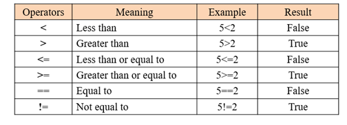

Iets uitvoeren als er op beide wordt gedrukt:

```python
from microbit import *
while True:
  if button_a.is_pressed() and button_b.is_pressed():
    display.scroll('knopA&B')
```

Er zijn dus vier combinaties met twee drukknoppen:
notA and notB / A and notB   / notA and B   / A and B
Dit behoort tot de logische operatoren.

### Logische operatoren


Vier toestanden met twee drukknoppen:

```python
from microbit import *
while True:
  if button_a.is_pressed() and button_b.is_pressed():
    display.show('A&B')
  if (button_a.is_pressed() and (not button_b.is_pressed())):
    display.show('A')
  if (not(button_a.is_pressed()) and (button_b.is_pressed())):
    display.show('B')
  if (not(button_a.is_pressed()) and (not button_b.is_pressed())):
    display.show('0')
```

**Tellen en weergeven van het aantal keren gedrukt op knop A**

Hier gaan we het aantal kliks op drukknop A bijhouden in een variabele (integer) met de naam teller. Telkens als er op de drukknop A wordt gedrukt moet de waarde van teller uit het geheugen gehaald worden (lezen), en moet daar 1 bij opgeteld worden. Daarna schrijven we het resultaat van die optelling terug naar het geheugen in dezelfde variabele teller (klaar voor de volgende klik).
Teller kan gereset worden door op drukknop B te drukken.

```python
from microbit import *
#declaratie van de teller variabele 
#en initialisatie op 0
teller = 0
while True:
  if button_a.was_pressed():
    teller = teller + 1
  if button_b.was_pressed():
    teller = 0
  display.scroll(teller)  
```

<div style="background-color:darkgreen; text-align:left; vertical-align:left; padding:15px;">
<p style="color:lightgreen; margin:10px">Opdracht: Programmeer een tafel van vermenigvuldiging. Telkens je op A drukt wordt de vermenigvuldig factor met 1 verhoogd.
Uitbreiding: Programmeer een toepassing waarbij je met A een teller tot een bepaalde waarde brengt. Door dan op B te drukken laat je een lichtje zoveel keer knipperen.
</p>
</div>

### Rekenkundige operatoren

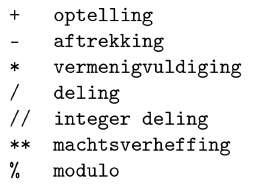

### Geluid met de Micro:Bit

De Micro:Bit bevat enkele actuatoren. De Led is een actuator (meerdere Led's samen vormen de Led-matrix op de Micro:Bit), maar er zit ook een microfoon (wat eigenlijk een sensor is) op de Micro:Bit die ook invers kan worden gebruikt om geluid af te spelen (dus nu actuator).
Een voorbeeldje van een sweep geluid tussen twee frequenties in een bepaalde tijd kan zo geactiveerd worden:

```python
from microbit import *
while True:
  if button_a.was_pressed():
    my_effect = audio.SoundEffect(freq_start=400, freq_end=2500, duration=500)
    audio.play(my_effect)
```

### Enkele programmeer voorbeeldjes:

#### Parkeer garage (V1)

Hier maken we een parking-display met aanduiding van het aantal bezette plaatsen. 

**Gegeven:**

Er zijn 10 plaatsen.</br>
Drukknop A => registratie aan de ingang </br>
Drukknop B => registratie aan de uitgang

**Gevraagd:**

Maak een teller zorg ervoor dat de teller niet boven de 10 plaatsen gaat en ook niet onder de 0 plaatsen gaat.

**Oplossing:**

```python
from microbit import *
#declaratie van enkele variabelen
max_plaatsen = 10
plaatsenbezet = 0
while True:
  if button_a.was_pressed():
    if plaatsenbezet < max_plaatsen:
      plaatsenbezet = plaatsenbezet + 1
  if button_b.was_pressed():
    if plaatsenbezet > 0:
      plaatsenbezet = plaatsenbezet - 1 
  display.scroll(plaatsenbezet) 
```

#### Lopende LED

```python
display.set_pixel(x,y,helderheid)
```

Met dit Micro:Bit statement kan een bepaalde pixel binnen de LED matrix worden aangestuurd.
Er wordt hier gebruik gemaakt van twee geneste FOR-loops om een loop-sequentie te programmeren.

```python
from microbit import *
#declaratie van enkele variabelen
max_plaatsen = 10
plaatsenbezet = 0
while True:
  for y in range(5):
    for x in range (5):
      display.set_pixel(x,y,9)
      sleep(50)
  sleep(1000)
  display.clear()
  sleep(1000)
```

<div style="background-color:darkgreen; text-align:left; vertical-align:left; padding:15px;">
<p style="color:lightgreen; margin:10px">Analyseer:  de werking en programmeer nog andere sequenties.
</p>
</div>

#### Parkeer garage (V2)

De bezette- / vrije plaatsen kunnen we ook grafisch aanduiden op de LED-matrix. Er zijn 5*5 LED’s, zo kunnen we een parkeergarage van 25 plaatsen visualiseren. 
Rekenkundige bewerkingen: de normale bewerkingen spreken voor zich: + - * die kunnen zowel met integer- als met float waarden werken. 

::: danger
Let wel : een computer kijkt steeds om een bewerking zo eenvoudig mogelijk uit te voeren. 
Dwz, als de parameters integer waarden zijn , dan zal de computer de bewerking ook uitvoeren met integer waarden en het resultaat zal ook een integer zijn. 
:::

Is echter een parameter een float dan zal de computer een complexere berekening uitvoeren en zal het resultaat ook een float zijn.
Met deze redenering is er echter een probleem bij de deling / . Twee integer waarden delen zal steeds een integer opleveren. Dit kan dus tot een onvolledige deling leiden. Vb:</br>
10/5 = 2</br>
5/2=2 !!!! volledig behandeld met integers</br>
5.0/2=2.5

Met integers kan ook een restdeling worden uitgevoerd (modulo deling). Vb:</br>
11%4 = 11 mod 4 = 3

Hiermee kunnen we de coördinaten van een LED x, y bepalen uit een groter getal:

```python
from microbit import *
#declaratie van enkele variabelen
max_plaatsen = 25
plaatsenbezet = 0
yPos = 0
xPos = 0
ledWaarde = 0
while True:
  if button_a.was_pressed():
    if plaatsenbezet < max_plaatsen:
      plaatsenbezet += 1
      ledWaarde = plaatsenbezet - 1
      xPos = ledWaarde % 5
      yPos = int(ledWaarde / 5)
      display.set_pixel(xPos, yPos, 9)
  if button_b.was_pressed():
    if plaatsenbezet > 0:
      plaatsenbezet -= 1
      ledWaarde = plaatsenbezet
      xPos = ledWaarde % 5
      yPos = int(ledWaarde / 5)
      display.set_pixel(xPos, yPos, 0)
```

### Touch logo

De Micro:Bit bevat ook een touch-logo (net zoals de drukknop ook een soort sensor). Dit is een soort drukknop die werkt op capacitieve verandering. Het volstaat om met de vinger hier dicht in de buurt te komen om de drukknop te activeren (analogie met een touch-screen)

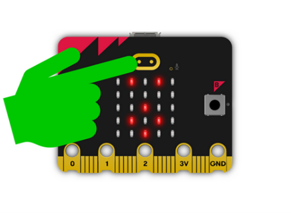

```python
from microbit import *
while True:
  if pin_logo.is_touched():
    display.show(Image.HAPPY)
    sleep(100)
    display.clear()
```

### Externe pinnen

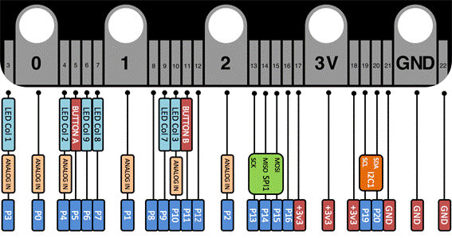

De meeste pinnen kunnen gebruikt worden als digitale in/uitgang. Sommige pinnen kunnen ook een als een analoge ingang worden gebruikt (om bv een analoge sensor die een analoge elektrische spanning afgeeft ifv een te meten grootheid als druk, temperatuur, geluid, licht, CO2, ….). Nog andere pinnen kunnen worden gebruikt binnen een bus-protocol standaard (SPI, I2C).
Zelf een drukknop maken kan eenvoudig door een elektrische verbinding te maken tussen de 0-pin en de GND. Dit met een elektrisch geleidende stof en niet met een isolator.

```python
from microbit import *
while True:
  if pin0.is_touched():
    display.show(Image.HAPPY)
  else:
    display.show(Image.SAD)
```

<div style="background-color:darkgreen; text-align:left; vertical-align:left; padding:15px;">
<p style="color:lightgreen; margin:10px">Opdracht: maak een knop met aluminiumfoliestrookjes en krokodil-klemmen. Is een menselijk lichaam een geleider of een isolator?
</p>
</div>

#### Capacitieve Touch pin P0

Een pin kan ook veel gevoeliger worden gemaakt door die als een touch-sensor te laten werken (capacitief). Hierbij is geen verbinding nodig naar de GND als je met je vinger in de buurt komt van P0. Dit kan door éénmalig de touch_mode op die pin als capacitive in te stellen.:

```python
from microbit import *
pin0.set_touch_mode(pin0.CAPACITIVE)
while True:
  if pin0.is_touched():
    display.show(Image.HAPPY)
  else:
    display.show(Image.SAD)
```

Standaard staan de pinnen op RESISTIVE.

### Random integer (dobbelsteen)

De Micro:Bit kan een random getal genereren tussen bepaalde grenzen. Hiervoor moet echter wel een aparte bibliotheek worden geïmporteerd. Met random.randint(ondergrens, bovengrens) kan dus een getal worden gegenereerd. 

```python
from microbit import *
import random
pin0.set_touch_mode(pin0.CAPACITIVE)
while True:
  if button_a.was_pressed():
    display.show(random.randint(1,6))    
```

<div style="background-color:darkgreen; text-align:left; vertical-align:left; padding:15px;">
<p style="color:lightgreen; margin:10px">Uitbreiding: maak op de LED matrix de visualisatie van een echte dobbelsteen.
</p>
</div>

```python
from microbit import *
import random
while True:
  if button_a.was_pressed():
    waarde = random.randint(1,6)  
    if waarde == 1:
      display.clear()
      display.set_pixel(2,2,9)
    elif waarde == 2:
      display.clear()
      display.set_pixel(0,0,9)
      display.set_pixel(4,4,9)
    elif waarde == 3:
      display.clear()
      display.set_pixel(0,0,9)
      display.set_pixel(2,2,9)
      display.set_pixel(4,4,9)
    elif waarde == 4:
      display.clear()
      display.set_pixel(0,0,9)
      display.set_pixel(0,4,9)
      display.set_pixel(4,0,9)
      display.set_pixel(4,4,9)
    elif waarde == 5:
      display.clear()
      display.set_pixel(0,0,9)
      display.set_pixel(2,2,9)
      display.set_pixel(0,4,9)
      display.set_pixel(4,0,9)
      display.set_pixel(4,4,9)
    else:
      display.clear()
      display.set_pixel(0,2,9)
      display.set_pixel(4,2,9)
      display.set_pixel(0,0,9)
      display.set_pixel(0,4,9)
      display.set_pixel(4,0,9)
      display.set_pixel(4,4,9)
```

## Functies/Methoden met een parameter

Je kan ook een aparte functie maken om de Leds aan te sturen in python. Functies worden binnen programmeertalen ook als methoden benoemd of subroutines. 
Vorige oefening van de dobbelsteen wordt hier in een functie verwerkt. De functie moet natuurlijk worden aangeroepen vanuit het hoofdprogramma.

```python
from microbit import *
import random
def toonLeds(waarde):
  if waarde == 1:
      display.clear()
      display.set_pixel(2,2,9)
    elif waarde == 2:
      display.clear()
      display.set_pixel(0,0,9)
      display.set_pixel(4,4,9)
    elif waarde == 3:
      display.clear()
      display.set_pixel(0,0,9)
      display.set_pixel(2,2,9)
      display.set_pixel(4,4,9)
    elif waarde == 4:
      display.clear()
      display.set_pixel(0,0,9)
      display.set_pixel(0,4,9)
      display.set_pixel(4,0,9)
      display.set_pixel(4,4,9)
    elif waarde == 5:
      display.clear()
      display.set_pixel(0,0,9)
      display.set_pixel(2,2,9)
      display.set_pixel(0,4,9)
      display.set_pixel(4,0,9)
      display.set_pixel(4,4,9)
    else:
      display.clear()
      display.set_pixel(0,2,9)
      display.set_pixel(4,2,9)
      display.set_pixel(0,0,9)
      display.set_pixel(0,4,9)
      display.set_pixel(4,0,9)
      display.set_pixel(4,4,9)

while True:
  if button_a.was_pressed():
    getal = random.randint(1,6)  
    toonLeds(getal)
```

## Gebeurtenis (event) bij schudden

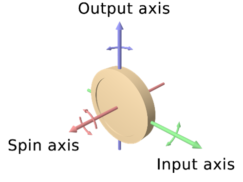

De Micro:Bit bezit een acceleratie-sensor die in de drie dimensies een versnelling kan waarnemen. Schudden is een actie die in de drie dimensies een versnelling kan veroorzaken. De Micro:Bit kan dit waarnemen en dit als voorwaarde worden gebruikt om een handeling uit te voeren. Is vergelijkbaar met een event op een knop maar nu niet drukken maar bij schudden.

<div style="background-color:darkgreen; text-align:left; vertical-align:left; padding:15px;">
<p style="color:lightgreen; margin:10px">Opdracht : laat de Micro:Bit een random getal genereren (0-100) bij het schudden van de Micro:Bit en geef dit getal weer op het LED-display.
</p>
</div>


```python
from microbit import *
import random
while True:
  if accelerometer.was_gesture('shake'):
    display.show(random.randint(1,100))    
```

### Schudden : Lovemeter

Idem als vorige opdracht maar nu interpreteren we de random waarde naar een symbool.
<ul>
<li>Getal tussen 0-30 : display.show(Image.SAD)</li>
<li>Getal tussen 30-60 : display.show(Image.SMILE)</li>
<li>Getal tussen 60-100 : display.show(Image.HAPPY)</li>
</ul>

```python
from microbit import *
import random
while True:
  if accelerometer.was_gesture('shake'):
    waarde = random.randint(1,100)
    if waarde < 30 :
      display.show(Image.SAD)
    elif waarde < 60 :
      display.show(Image.SMILE)
    else:
      display.show(Image.HAPPY)
```

## Analyse sensoren

Op de Micro:Bit zitten al een aantal sensoren die in python kunnen worden uitgelezen. Onboard:

<ul>
<li>Accelerosensor : 3-dimensionele versnelling (g-force)</li>
<li>Magnetisme : 3-dimensionele magnetische veldsterkte  (µ-tesla)</li>
<li>Geluidsensor</li>
<li>Temperatuursensor</li>
<li>Lichtsensor</li>
<li>Voel-sensoren (drukknoppen, en touch sensor, externe: pinnen)</li>
</ul>

Om een analyse (studie) te maken over de werking en verwerking van data binnen de Micro:Bit kunnen we gebruik maken van het print() python statement. De Micro:Bit kan zeker uitgebreid worden met externe sensoren door die juist aan te sluiten op de beschikbare pinnen.
Analyse van lichtsensor:

```python
from microbit import *
while True:
  tekst = 'De hoeveelheid licht = ' + str(display.read_light_level())
  print(tekst)
  sleep(500)
```

Met het print commando stuur je data van de Micro:Bit naar de computer. Op de computer kan via het venster Show Serial.
In de code zie je ook een type casting (convertie/omzetting) van een integer waarde naar een string :
str(integer).
Je ziet ook een concatenatie van twee strings.

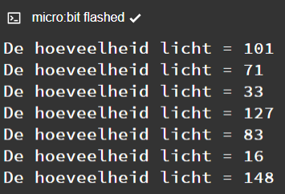

### Automatische verlichting

<div style="background-color:darkgreen; text-align:left; vertical-align:left; padding:15px;">
<p style="color:lightgreen; margin:10px">Opdracht : Zorg dat de LED matrix in drie helderheden wordt aangestuurd afhankelijk van het invallend licht. Analogie met de automatische verlichting bij een wagen die een tunnel binnen komt. Wanneer geen lichten? Wanneer kleine lichten? Wanneer grote lichten? Bepaal eerst aan de hand van uw testen de twee grenswaarden voor de lichtsensor.
</p>
</div>

```python
# Imports go at the top
from microbit import *
# Code in a 'while True:' loop repeats forever
while True:
     if (display.read_light_level() < 100):
         display.show(Image('30903:'
                            '06960:'
                            '99999:'
                            '06960:'
                            '30903'))
         
     elif (display.read_light_level() < 150):
         display.show(Image('00300:'
                            '03630:'
                            '36963:'
                            '03630:'
                            '00300'))
         
     else:
         display.clear()
         
    
```

::: tip
**Uitbreiding:**
Gebruik meerdere niveaus om meerdere helderheden toe te passen.
:::

### Geluidsensor

Gelijkaardig kan je een analyse doen met de geluidsensor. Doe dit eerst door de waarde van het geluid te **PRINTEN** naar de Serial console. Bepaal hiermee welke waarden vertegenwoordigen stil/luid? Wat is stil? Wat is luid? Bepaal een grenswaarde en schrijf dan code om een alarm te maken wanneer er teveel lawaai is in de klas.
Meet het geluid in Python met het statement : 

```python
microphone.sound_level()
```

### Temperatuursensor

<div style="background-color:darkgreen; text-align:left; vertical-align:left; padding:15px;">
<p style="color:lightgreen; margin:10px">Opdracht: Meet de temperatuur in de klas en display de temperatuur op de LEDS als getal of als figuur of met pixels. Print ook die waarde eens realtime naar de Serial Console.
</p>
</div>

Lees de temperatuur in Python met:  

```python
temperature()
```

### Accelerosensor

Opnieuw gelijkaardig kan de accelerosensor worden geanalyseerd. Echter bezit de accelerosensor niet één enkele meetwaarde maar drie meetwaarden volgens de versnelling in de drie dimensies (X, Y en Z as).

```python
accelerometer.get_x()
```

Bepaal zelf via printen naar de Serial console wat X, Y en Z is. De versnelling wordt uitgedrukt in milli-G-kracht (versnelling 1G = 9,81m/s²). Op die manier kan zwaartekracht berekend worden uit massa en versnelling F=m.a (vb m=80kg en a=9,81m/s² => F=78,48N). 

Bepaal zelf wat en waar is in de x-richting de versnelling = 1000mG, waar en hoe 0, waar en hoe max positief, max negatief?
Idem voor de y-richting en de z-richting?

### Magnetischesensor

Met de Micro:Bit kan ook een magnetisch veld worden gemeten. Opnieuw kan dit in de 3-dimensionele ruimte adhv de 3 assen (X, Y en Z). Hiermee kan een kompas worden gemaakt die volgens een as van de micro:bit (meestal X) het aardmagnetisme kan meten. Maar het kan ook magnetische velden van losse magneten meten en bepalen waar zich een NOORD of een ZUIDPOOL ligt. 
Echter is het wel zo dat wanneer je deze sensor wenst te gebruiken de Micro:Bit een kalibratie procedure zal vragen die moet uitgevoerd worden op de Micro:Bit vooraleer deze kan worden gebruikt.

<div style="background-color:darkgreen; text-align:left; vertical-align:left; padding:15px;">
<p style="color:lightgreen; margin:10px">Opdracht: Experimenteer met deze sensor door gebruik te maken van het Python commando : compass.get_x()
</p>
</div>

Stuur opnieuw waarden naar de Serial console na de kalibratie procedure gevolgd te hebben (zie instructies op de Micro:Bit zelf).

## Datalogging

Nu je wat ervaring hebt met de verschillende sensoren wil je veelal waarden van die sensoren gaan loggen (data wegschrijven op de Micro:Bit zelf en die bijhouden) gedurende een bepaalde tijd of een bepaalde omstandigheid om er dan nadien een analyse op uit te voeren eventueel met Excel. 
We wensen dus bijvoorbeeld de lichtsterkte (zonlicht) te monitoren gedurende een volledige dag en dit door iedere minuut een lichtmeting uit te voeren. 
Dit kan met de Micro:Bit in Python als volgt gebeuren. In het voorbeeld wordt er per seconde gelogd om het iets sneller te laten verlopen.

```python
# Imports go at the top
from microbit import *
import log

log.set_labels('light')

@run_every(s=1)
def log_data():
    my_effect = audio.SoundEffect(duration=10)
    audio.play(my_effect)
    log.add({'light': display.read_light_level()})

while True:
    sleep(100000)
```

**Uitleg code**: 

<ul>
<li>Vooreerst zie je dat een extra import moet uitvoeren van log</li>
<li>Daarna moet één keer log.set_labels() worden uitgevoerd die aangeeft wat de hoofding (gewoon tekst) van die reeks getallen zal inhouden. Stel dat je meerdere verschillende waarden wil loggen op het zelfde moment, dan kunnen die waarden gescheiden worden van elkaar door ze in aparte kolommen op te nemen en de kolom te voorzien van een hoofding (titel). Dit kan achteraf eenvoudig in Excel worden gelezen.</li>
<li>We zien dat er in de code een oneindige lus (While True:) is opgenomen maar dat we daar niets in doen. We laten daar de Micro:Bit slapen gedurende 100000 seconden. We kunnen gerust de Micro:Bit iets anders laten doen in de oneindige lus  (zie later)</li>
<li>Er is een aparte functie (zie eerder) opgenomen in de code met de naam:  log_data() zonder parameter. Deze methode of functie wordt aangeroepen (uitgevoerd) op basis van een timer:  @run_every(h=1, min=20, s=30, ms=50). </li>
<li>In die timer functie wordt een klein beepje afgespeeld zodat je de werking van de timer kan horen. Bij werking kan natuurlijk dit worden weggelaten.</li>
</ul>

Als je nu de gelogde data wenst te lezen dan kan je als volgt doen:

<ul>
<li>Ontkoppel de Micro:Bit van de USB-kabel en wacht 10 seconden en koppel die terug aan (let wel de logging zal opnieuw starten, maar de oude data is bereikbaar , nieuwe logging data zal maar bereikbaar zijn na een volledige reset van de Micro:Bit => ontkoppel van USB / wacht 10sec / en koppel terug aan de computer)</li>
<li>Ga naar de Verkenner van de computer en zoek naar de extra harddrive die de Micro:Bit heeft gemaakt tijdens het koppelen:</li>
</ul>


Klik op die drive en zoek het bestand: MY_DATA.HTM

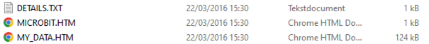

Open dit bestand door dubbelklik:

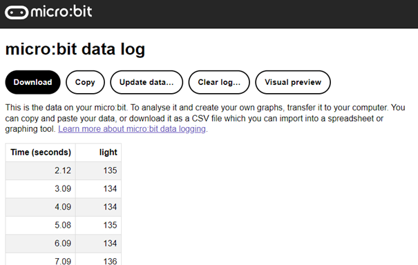

Met copy kan je de lijst exporteren naar Excel (CSV). Met Visual preview kan je een grafische weergave bekijken van de data.

## Starten en stoppen van Data logging en clear de data

Soms is het handig om het proces te kunnen starten en stoppen. Met knop A kan het loggen worden gestart en gestopt. Met knop B kan de log data worden gewist. 

```python
# Imports go at the top
from microbit import *
import log

log.set_labels('X','Y','Z', timestamp=log.MILLISECONDS)
logging = False

@run_every(ms=50)
def log_data():
    if logging == True:
        log.add({'X': accelerometer.get_x(),'Y': accelerometer.get_y(),'Z': accelerometer.get_z()})

# Code in a 'while True:' loop repeats forever    
while True:
    if button_a.was_pressed():
        logging = not logging
        if logging == True:
            display.set_pixel(2,2,9)
        else:
            display.clear()
    if button_b.was_pressed():
        log.delete()
        display.show(Image.SQUARE_SMALL)
        sleep(500)
        display.clear()
        log.set_labels('X','Y','Z', timestamp=log.MILLISECONDS)
        
```

## Externe hardware

Alhoewel de Micro:Bit op zich kan gebruikt worden met zijn onboard sensoren en actuatoren, kunnen de mogelijkheden en de inzetbaarheid van de Micro:Bit worden uitgebreid door er externe hardware aan te koppelen. Dit zijn meestal ook sensoren en/of actuatoren. Het is onmogelijk om hier volledig te zijn, de uitbreidingen zijn grenzeloos zolang er connectie mogelijkheden (externe pinnen) voor handen zijn op de Micro:Bit. Een beperking in die mogelijkheden dringt zich hier op, en er worden er maar enkele besproken.


Extra externe hardware kan gekoppeld worden via de pinnen van de Micro:Bit. Er zijn maar drie pinnen vlot toegankelijk die gekenmerkt worden door 0, 1 en 2. Een pin kan softwarematig worden geconfugureerd als ingang of als uitgang. 

> - Een ingang zal gebruikt worden om door de microcontroller te worden gelezen, hierop zal dus één of andere vorm van sensor of detector worden aangesloten. Meest eenvoudige vorm van zoiets is een drukknop.
> - Een uitgang zal gebruikt worden om door de microcontroller te worden aangestuurd, hierop zal dus één of andere vorm van actuator worden aangesloten. Meest eenvoudige vorm van zoiets is een LED.

Om van meerdere pinnen gebruik te kunnen maken is er nood aan een GPIO-ADAPTOR. 

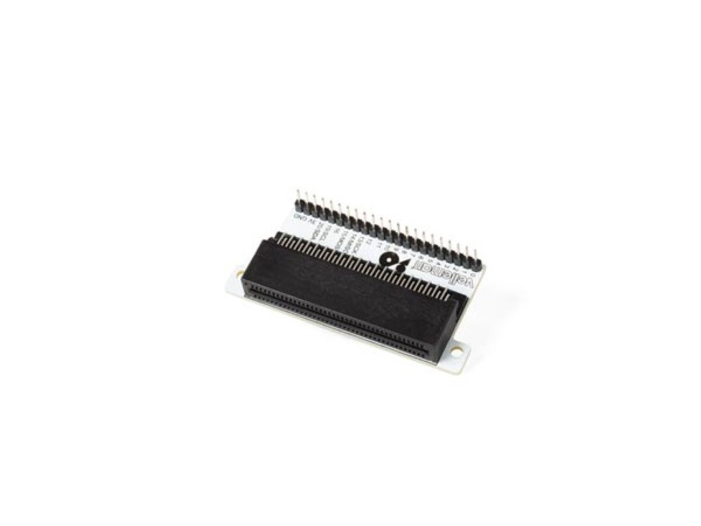

Op een breadboard kan dan via draadjes verbindingen en schakelingen worden gebouwd. 

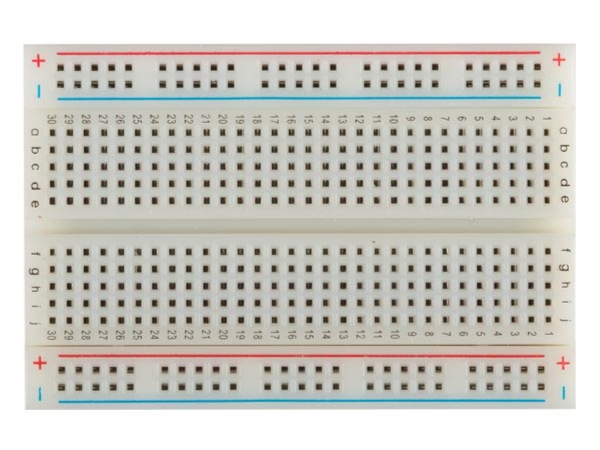

De doorverbindingen van het breadboard ziet er als volgt uit:


### Een verkeerslicht bouwen

Om een verkeerslicht te maken worden de drie uitgangen van de Micro:Bit gebruikt.


Bij het bouwen van de schakeling moet je weten dat een led een positieve aansluiting (=anode)
heeft en een negatieve aansluiting (=kathode). De Anode moet verbonden worden met de weerstanden.
De aansluiting van de anode is langer dan de aansluiting van de kathode.
De weerstanden hebben een waarde van 150Ω (=150 Ohm), 120Ω en 39Ω. Dit kan je zien aan de 4
gekleurde bandjes waarvan de eerste drie banden de waarde voorstellen.
De weerstandswaarde van de weerstand verbonden met de rode led is 150Ω (bruin, groen, bruin).
De weerstandswaarde van de weerstand verbonden met de gele led is 39Ω (oranje, wit, zwart).
De weerstandswaarde van de weerstand verbonden met de groene led is 120Ω (bruin, rood, bruin).

De python code om een knipperled te programmeren ziet er als volgt uit (hier is de externe LED is aangesloten op pin1):

```python
# Imports go at the top
from microbit import *

# Code in a 'while True:' loop repeats forever
while True:
    pin1.write_digital(0)
    sleep(1000)
    pin1.write_digital(1)
    sleep(1000)
```


> In vorige programma's hebben we de leds op de LED-matrix geprogrammeerd. Nu willen we een stap verder gaan door de externe pinnen P0, P1 en P2 aan te sturen waarmee de leds zijn verbonden. Als we zo een pin hoog maken (=1), wil dit zeggen dat er 3V op de pin geplaatst zal worden en die de aangesloten led zal doen branden. Als we zo een pin laag maken (=0), wil dit zeggen dat er 0V op de pin geplaatst zal worden en die de > aangesloten led niet zal doen branden.

<div style="background-color:darkgreen; text-align:left; vertical-align:left; padding:15px;">
<p style="color:lightgreen; margin:10px">Opdracht: Bouw deze schakeling en programmeer de code zodat het rode licht 5 seconden brandt.
Vervolgens moet het oranje of gele licht 2 seconden branden en tenslotte het groene licht 5 seconden. Laat het voorgaande continu herhalen.
</p>
</div>

### De digitale ingang

De werking van de digitale ingang wordt uitgelegd aan de hand van een drukknop.
Aan een digitale ingang kunnen we sensoren aansluiten die de microcontroller gaat zeggen als er een spanning wel of niet aanwezig is.
Een voorbeeld van een sensor die een digitale waarde geeft is een drukknop.

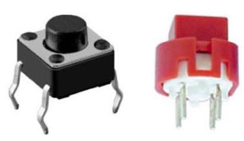

Op de micro:bit zijn er twee drukknoppen aanwezig die gebruikt kunnen worden. De drukknoppen noemen A en B. Die werden reeds eerder gebruikt.

<div style="background-color:darkgreen; text-align:left; vertical-align:left; padding:15px;">
<p style="color:lightgreen; margin:10px">Opdracht: Zorg dat de hardware van het verkeerslicht is aangesloten.
Maak een programma dat het groene licht brandt voor 5 seconden als er op drukknop A wordt gedrukt. Als er op knop B wordt gedrukt moet het oranje licht branden voor 2 seconden en nadien het rode licht voor 5 seconden.
</p>
</div>
<hr>
<div style="background-color:darkgreen; text-align:left; vertical-align:left; padding:15px;">
<p style="color:lightgreen; margin:10px">Opdracht: Maak gebruik van het verkeerslicht op het breadbord.
We gaan in het programma voortdurend vergelijken of drukknop B ingedrukt wordt.
Als er op drukknop B gedrukt wordt moet het groene licht branden voor 5 seconden, gevolgd door
het oranje licht dat brandt gedurende 2 seconden.
Als er niet op de drukknop B gedrukt wordt moet het rode licht branden.
</p>
</div>
<hr>
<div style="background-color:darkgreen; text-align:left; vertical-align:left; padding:15px;">
<p style="color:lightgreen; margin:10px">Opdracht: Maak gebruik van het verkeerslicht op het breadbord. Maak een programma als er op drukknop A wordt gedrukt, het groene licht brandt voor 5 seconden. Als er NIET op drukknop A wordt gedrukt en als er op drukknop B wordt gedrukt moet het rode licht branden voor 5 seconden. Als er niet aan de beide voorwaarden wordt voldaan (= niet op drukknop A of B gedrukt wordt) moet het gele licht branden.
</p>
</div>
<hr>
<div style="background-color:darkgreen; text-align:left; vertical-align:left; padding:15px;">
<p style="color:lightgreen; margin:10px">Opdracht: Maak gebruik van het verkeerslicht op het breadbord. Maak een programma als er op drukknop A wordt gedrukt het groene licht brandt voor 5 seconden. Als er NIET op drukknop A wordt gedrukt en als er op drukknop B wordt gedrukt, moet het rode licht branden voor 5 seconden. Als er niet aan de beide voorwaarden wordt voldaan (= niet op drukknop A of B wordt gedrukt) moet het oranje licht knipperen (500ms aan en 500ms uit).
</p>
</div>
<hr>
<div style="background-color:darkgreen; text-align:left; vertical-align:left; padding:15px;">
<p style="color:lightgreen; margin:10px">Opdracht: Gebruik het breadbord met het verkeerslicht. Maak een programma dat enkel het groene licht
brandt als drukknop B niet is ingedrukt.
</p>
</div>
<hr>
<div style="background-color:darkgreen; text-align:left; vertical-align:left; padding:15px;">
<p style="color:lightgreen; margin:10px">Opdracht: Maak gebruik van het verkeerslicht op het breadbord.
Maak een programma door gebruik te maken van de geziene booleaanse operatoren.
Als drukknop A is ingedrukt mag enkel de groene led branden.
Als drukknop B is ingedrukt mag enkel de rode led branden.
Als drukknop A en B is ingedrukt mag enkel de oranje led branden.
Als geen enkele drukknop is ingedrukt dan mag er geen enkele led branden.
</p>
</div>
<hr>
<div style="background-color:darkgreen; text-align:left; vertical-align:left; padding:15px;">
<p style="color:lightgreen; margin:10px">Opdracht: Maak gebruik van het verkeerslicht op het breadbord.
Maak een programma waarbij het oranje licht brandt als drukknop A of drukknop B is ingedrukt.
Als er geen enkel drukknop is ingedrukt moet de oranje led uit zijn.
De rode en groene led worden niet gebruikt.
</p>
</div>

### De externe digitale ingang

Tot nu toe hebben we altijd de drukknoppen gebruikt die op de micro:bit staan.
Natuurlijk kan er extern ook een drukknop aangesloten worden.
Een drukknop moet verbonden worden met een digitale ingang.
Een drukknop kan op alle pinnen aangesloten worden.
We gaan het verkeerslicht uitbreiden door een externe drukknop aan te sluiten op pin 8.

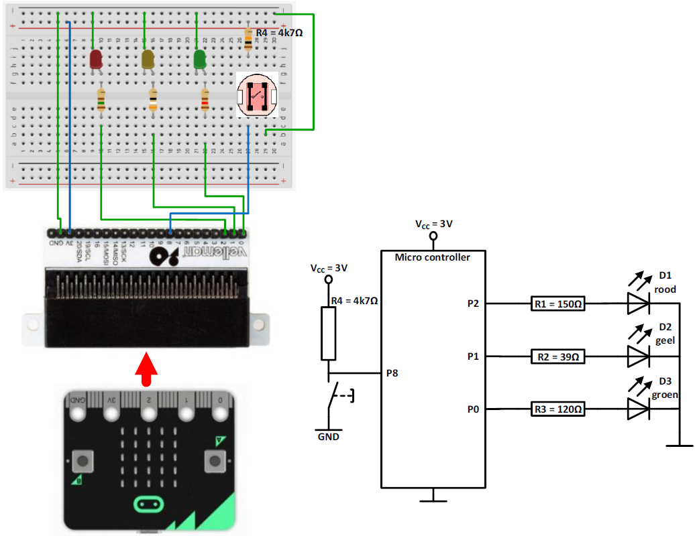

Voor het schema wordt een Pull-up weerstand gebruikt. Deze moet zeker geplaatst worden zodat de micro:bit niet defect zou geraken.
De drukknop heeft twee toestanden. Als hij niet ingedrukt is leest de ingang een hoge spanning (linkse figuur). Als de knop ingedrukt is leest de ingang een lage spanning (rechtse figuur).
Dit is een digitale sensor (=detector) omdat de drukknop maar twee toestanden kan weergeven, namelijk ingedrukt, aan, hoog of 1. De andere toestand is niet ingedrukt, uit, laag of 0.

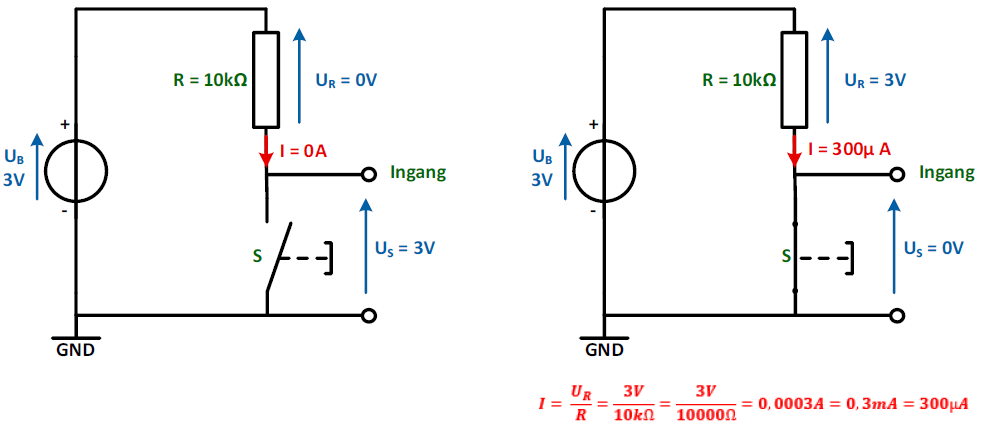

Een reden waarom er een weerstand gebruikt wordt is omdat in beide schakelstanden de
ingang aan een vast potentiaal moet hangen (0V of 3V). Aan een ingang waar geen pull-up gebruikt
wordt zal in geopende stand een antenne vormen. Dit wil zeggen dat door storingen de
microcontroller een hoge of een lage spanning kan zien wat een ongewenst gedrag van de
microcontroller als gevolg heeft.

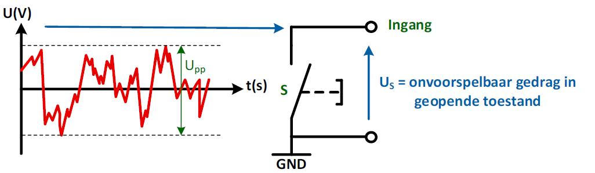

Dit zorgt voor volgend overzicht:

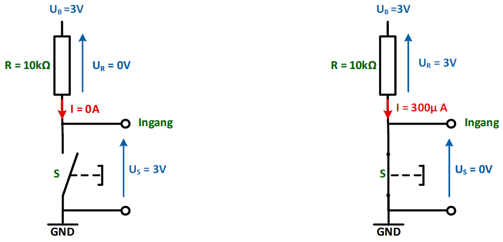

Een goede technicus zal na het bouwen altijd meten of de hardware wel juist werkt. Dit kan best met een multimeter op de stand Vdc. Hiermee wordt een gelijkspanning gemeten. 

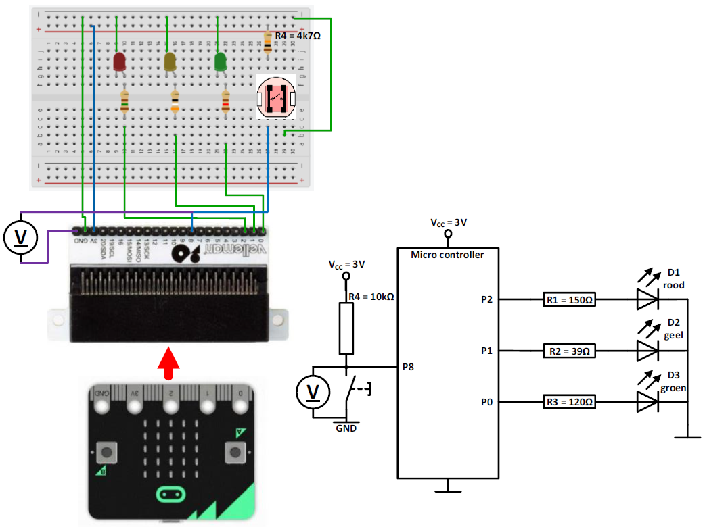

::: warning
Niet drukken levert een spanning op die gelijk is aan de voedingsspanning van de microcontroller. Wel drukken levert een 0 volt meting op.
:::


> - Als de drukknop niet is ingedrukt moet de waarde op de voltmeter gelijk zijn aan de voedingsspanning van de schakeling. Hier is dat 3V.
> - Als de drukknop is ingedrukt moet de waarde op de voltmeter gelijk zijn aan 0V.

In de software kan gebruik gemaakt worden van twee soorten instructies (statements) om de toestand van een digitale ingang in te lezen en afhankelijk van de ingelezen toestand een actie daaraan te koppelen. 

<div style="background-color:darkgreen; text-align:left; vertical-align:left; padding:15px;">
<p style="color:lightgreen; margin:10px">Opdracht: Experimenteer met volgende code en trek uw conclusies. Hoe werken volgende instructies? Wat is het verschil? In welke gevallen (teken het schema) worden deze instructies gebruikt?
</p>
</div>

```python
# Imports go at the top
from microbit import *


# Code in a 'while True:' loop repeats forever
while True:
    #werkt met een externe pull-up weerstand
    if pin1.read_digital() == False:
       display.show(1)  #getoond als pin1 = 0v
    else:
      display.clear() #clear scherm als pin1 = 3v
    #werkt met een interne pull-up weerstand
    if pin0.is_touched():
       display.show(0)  #getoond als pin0 = 0v

```

<div style="background-color:darkgreen; text-align:left; vertical-align:left; padding:15px;">
<p style="color:lightgreen; margin:10px">Opdracht: Maak gebruik van het breadbord en het verkeerslicht. Maak een programma waarbij het verkeerslicht alleen rood is als de externe knop niet wordt ingedrukt. Als de knop wordt ingedrukt moet enkel de groene led branden.
</p>
</div>

### Analoge ingangen

Microcontrollers worden vaak gebruikt als interface om analoge signalen om te zetten naar een digitale waarde. Zij moeten in staat zijn om analoge ingangssignalen, bijvoorbeeld van een microfoon of temperatuursensor, om te zetten in digitale gegevens. Pinnen op de micrp:bit kunnen niet alleen als digitale GPIO fungeren, maar ze zijn in staat om ook analoge spanningen binnen te lezen. Intern in de microcontroller wordt dan gebruik gemaakt van een ADC (analoog naar digitaal converter). 

Een analoog naar digitaal convertor (ADC) is een elektronische schakeling waarvan de waarde van de uitgang recht evenredig is met het analoge  ingangssignaal. De ADC meet de ingangsspanning en geeft een binaire waarde aan de uitgang evenredig met de ingangsspanning. Het ingangsbereik van de ADC wordt bepaald door een referentie spanning (Vref). Bij de meeste controllers wordt hier de voedingsspanning gebruikt.

")

De conversie wordt gestart door de digitale ingang SC (Start conversion) hoog te maken. De conversie duurt een tijdje. Als de conversie volbracht is wordt de digitale EOC (End of conversion) uitgang hoog gemaakt. Vanaf dat de digitale ingang OE (Output Enable) hoog gemaakt wordt zal de digitale waarde op een data-bus worden geplaatst.

In de volgende figuur wordt er een 3 bit conversie gedaan van het analoog signaal. Men krijgt hier de typische trapfunctie met hier 8 treden. Met 3 bit verdeelt men het bereik in 23 = 8 stappen.

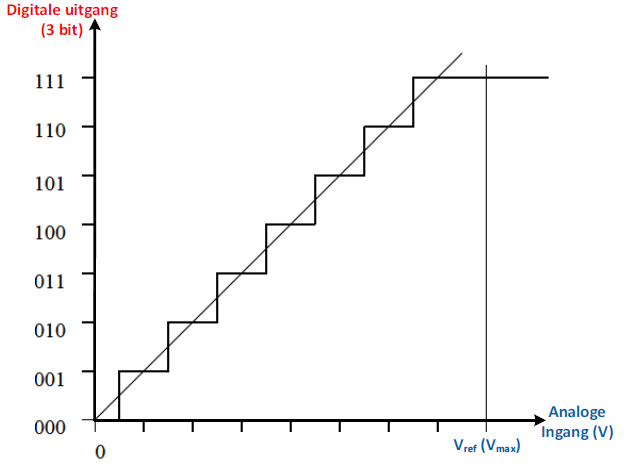

De hoogste digitale waarde aan de uitgang komt overeen met de referentiespanning, die de maximum spanning is aan de ingang.

**Resolutie en afwijking**

Door een analoog signaal om te zetten in een digitaal signaal benaderen we bijna het werkelijk verloop, aangezien elke digitale uitgangswaarde een zeer klein bereik van analoge ingangsspanningen moet vertegenwoordigen, d.w.z. de breedte van een van de treden op de ‘trap’ n.

Als we een analoog signaal met een bereik van 0V tot 3,3V willen omzetten naar een 8-bits digitaal signaal, dan zijn er 256 (d.w.z. 2<sup>8</sup>) verschillende uitgangswaarden. Elke trap heeft een breedte van: $${3,3V \over 256} = 12,89mV$$ met de grootste afwijking is de helft van één stap: $${12,89mV \over 2} = 6,45mV$$

De micro:bit gebruikt een 10 bit ADC, dan zijn er 1024 (d.w.z. 2<sup>10</sup>) verschillende uitgangswaarden. Elke trap heeft een breedte van: $${3,3V \over 1024} = 3,22mV$$ met de grootste afwijking is de helft van één stap: $${3,22mV \over 2} = 1,611mV$$

**Sampling frequentie**

Bij het omzetten van een analoog signaal naar digitaal signalen nemen we herhaaldelijk een 'sample' en kwantificeren dit tot de nauwkeurigheid die de resolutie van onze ADC aangeeft. Hoe meer monsters er worden genomen, hoe nauwkeuriger de digitale gegevens zijn. Monsters of samples worden normaal gesproken op vaste tijdstippen genomen (d.w.z. bv. om de 0,2 ms) en bepalen de bemonsteringsfrequentie (het aantal monsters dat per seconde wordt genomen). De bemonsteringsfrequentie moet worden gekozen in verhouding tot de snelheid waarmee de bemonsterde gegevens veranderen. Als de samplefrequentie te laag is, is het mogelijk dat snelle veranderingen in het analoge signaal niet duidelijk zijn in het resulterende digitale signaal.
Daarom stelt het Nyquist-bemonsteringscriterium dat de bemonsteringsfrequentie ten minste het dubbele moet zijn van de hoogste frequentie van het ingangssignaal.

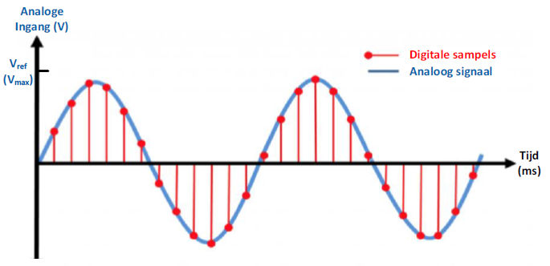

De volgende code bezit een sampletijd van 100 milliseconden, dus is de sample frequentie = $$ {1 \over 100ms} = 10Hz $$.

```python
# Imports go at the top
from microbit import *

# Code in a 'while True:' loop repeats forever
while True:
    waarde = pin1.read_analog()
    print('De ingelezen analoge waarde op pin P1 = ', str(waarde))
    sleep(100)
```

Het meest eenvoudige component om een analoge spanning te maken is een potentiometer. Dit is een regelbare weerstand, die bezit 3 aansluitklemmen. De vaste weerstand van de potentiometer wordt aangesloten op de voedingsspanning (0V & 3V). De derde pin, die de loper wordt genoemd bevat een variabele spanning tov de 0V. 

Het schema ziet er als volgt uit:

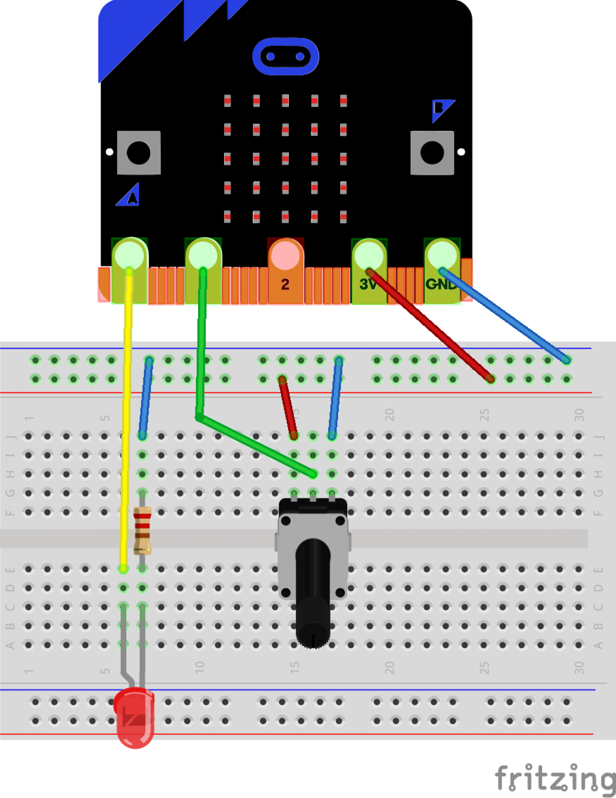


### PWM uitgangen

PWM is de afkorting van Pulse With Modulation. In het Nederlands heet dit Puls breedte modulatie of beter puls breedte sturing.
Puls breedte modulatie is een eenvoudige methode om op een digitale uitgang een blokgolfspanning te voorzien om zo een semi-analoge spanning op de uitgang te krijgen.
In volgende figuur wordt de helft van de tijd de uitgang hoog gemaakt en de andere helft van de tijd de uitgang laag. Dit wil zeggen dat de gemiddelde spanning op de uitgang gelijk wordt aan de helft van de voedingsspanning. In deze figuur is dit de helft van 3,3V gelijk aan 1,65V.

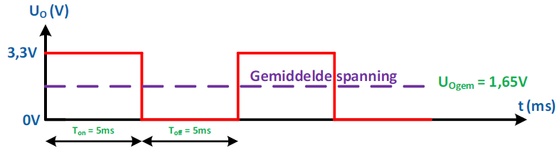

Door de frequentie van de blokgolfspanning groot te nemen wordt dit bij het aansturen van verlichting (LED's) door het menselijk oog niet gezien als een knipperende verlichting (door de traagheid van het oog) maar als een gedimde verlichting. Bij DC-motoren zal dit ook niet leiden tot een schokkerig draaien maar als het trager draaien van de motor (door de inertie van de rotor van de motor).
Men noemt de duty-cycle de verhouding van de aan-tijd (Ton) van het signaal ten opzichte van de volledige tijd van de periode (Ton+Toff), uitgedrukt in procent.

$$  \delta = {Ton \over T} * 100\%  = 50\% $$


Als je de duty-cycle vermenigvuldigd met de voedingsspanning dan bekom je de gemiddelde uitgangsspanning.

$$  Uogem = \delta * Uv  = 3,3V * 50\% = 1,65V $$

PWM-besturing wordt gebruikt in een verscheidenheid aan toepassingen, variërend van communicatie tot automatische besturing. Het dimmen van ledverlichting tot het toerental regelen van een DC-motor, … .

Ook servo motoren maken gebruik van een soort PWM signaal (vaste frequentie met beperkt duty-cycle gebied).

De periode (=T) wordt normaal gesproken constant gehouden, en de puls breedte, of "aan" tijd (=Ton) wordt gevarieerd.

In volgende figuren zijn enkele voorbeelden van PWM-signalen weergegeven.

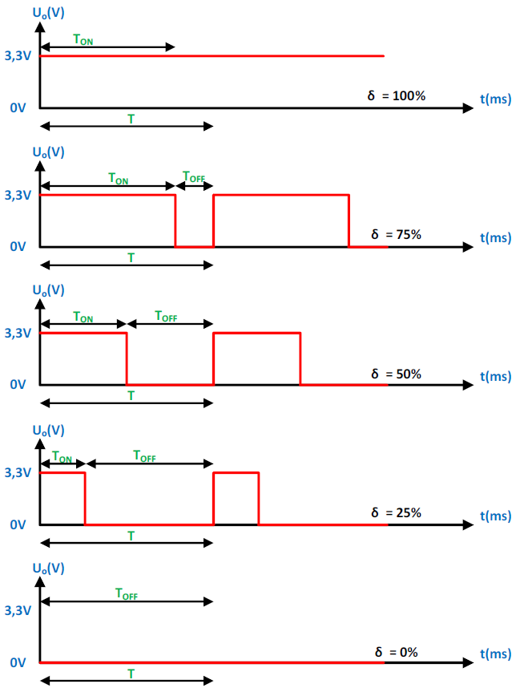

Bij de micro:bit kunnen pinnen worden ingesteld en aangestuurd worden als digitale PWM output pinnen. In de software kan dit als volgt: 

```python
# Imports go at the top
from microbit import *

pin0.set_analog_period(20)#instellen van de frequentie van PWM in milliseconden (min 1)
#pin0.set_analog_period_microseconds(1000) #instellen van de frequentie van PWM in microseconden (min 256)
pin0.write_analog(512)#0-1023 = 0%-100% duty cycle (hier 50%)

# Code in a 'while True:' loop repeats forever
while True:
   for i in range(1023):  
    pin0.write_analog(i)#0-1023 = 0%-100% duty cycle
    sleep(100)

```

Zoals je in vorig voorbeeld ziet wordt pin P0 gebrukt als PWM output kanaal. Er wordt een periode ingesteld van 20 ms, wat dus een frequentie is van 50Hz. Het knipperen van een LED zal hierbij niet zichtbaar zijn. Bij een lagere frequentie zou dit wel al zichtbaar moeten zijn, wat natuurlijk niet gewenst is. Instellen van de periode moet maar 1 keer gebeuren, vandaar dat dit statement voor de WhileTrue loop staat. 

Daarna wordt 1 keer de duty cycle ingesteld op 50%. In de WhileTrue loop zal de duty cycle in 1024 stappen geregeld worden van 0% naar 100%.

Indien gewenst bij nog hogere frequentie, zou de periode van het PWM signaal ook kunnen worden uitgedrukt in microseconden. 

<div style="background-color:darkgreen; text-align:left; vertical-align:left; padding:15px;">
<p style="color:lightgreen; margin:10px">Opdracht: Koppel extern een LED met voorschakelweerstand op een pin van de micro:bit. Regel de lichtsterkte van de LED via een PWM signaal. Visualiseer met een oscilloscoop het signaal. </br>
Uitbreiding : Regel de helderheid van de LED via een potentiometer.
</p>
</div>

### Aansturen van servomotoren

Een normale servomotor is een motor die we kunnen laten draaien tussen een hoek van 0° en 180°. Er bestaan ook 360° servo motoren, die kunnen dan volledige toeren draaien en dus continu blijven draaien.
De servomotor heeft drie aansluitingen. Twee aansluitingen zijn voor de voedingsspanning en een derde aansluiting dient om een PWM-signaal
aan te sluiten. Afhankelijk van het PWM-signaal zal de motor draaien tussen de 0° en de 180° en alle waarden er tussenin.

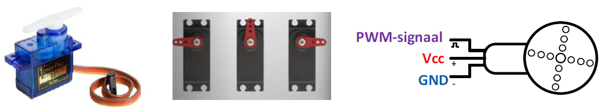


De frequentie van het PWM signaal is 50Hz. De periode bedraagt dan 20ms 

$$  T = {1 \over f}  $$

Als de breedte van de puls gelijk is aan 1,25ms dan is de hoek 0°.
Als de breedte van de puls gelijk is aan 1,75ms dan is de hoek 180°.

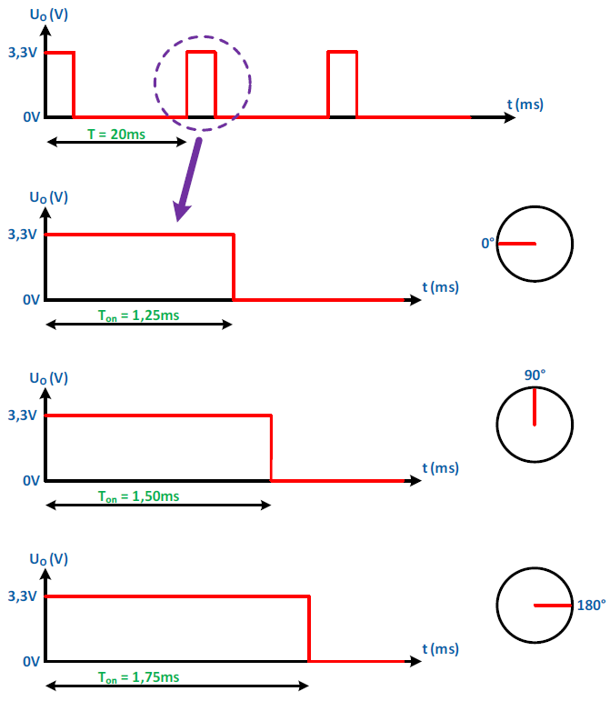

Bij 0° is de pulsbreedte 1,25ms en de periode 20ms.

$$  \delta = {Ton \over T} * 100\%  = {1,25ms \over 20ms} * 100\% = 6,25\% $$

Bij 90° is de pulsbreedte 1,50ms en de periode 20ms.

$$  \delta = {Ton \over T} * 100\%  = {1,50ms \over 20ms} * 100\% = 7,5\% $$


Bij 180° is de pulsbreedte 1,75ms en de periode 20ms.

$$  \delta = {Ton \over T} * 100\%  = {1,75ms \over 20ms} * 100\% = 8,75\% $$


Omdat servomotoren heel veel gebrukt worden bij microcontrollers zijn er soms speciale bibliotheek ontworpen om het gebruik van een servomotoren zo eenvoudig mogelijk te maken. Bij de micro:bit kunnen we gewoon gebruik maken van de kennis van PWM om die motor aan te sturen. Voorbeeld code zou het volgende kunnen zijn:

```python
# Imports go at the top
from microbit import *

# Servo control: 
# 50 = ~1 millisecond pulse all right 
# 75 = ~1.5 millisecond pulse center 
# 100 = ~2.0 millisecond pulse all left 
pin0.set_analog_period(20)

while True: 
	pin0.write_analog(75)
	sleep(1000)
	pin0.write_analog(25)
	sleep(1000)
	pin0.write_analog(125)
	sleep(1000)

```


<div style="background-color:darkgreen; text-align:left; vertical-align:left; padding:15px;">
<p style="color:lightgreen; margin:10px">Opdracht: Koppel extern een servomotor op een pin van de micro:bit. Regel de positie van de servomotor via een PWM signaal door de waarde van een aangesloten potentiometer in te lezen. Visualiseer met een oscilloscoop het signaal.
</p>
</div>


<hr>

::: tip
Wens je je nog te verdiepen in python en de micro:bit. Maak dan volgende opdrachten via deze link:
[Extra opdrachten met de micro:bit en python](microbit_oef.md)
:::


Have fun with Micro:Bit,
Wim


