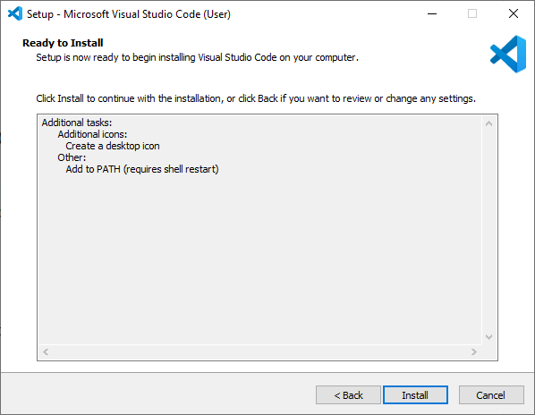

# Installatie software + preparatie Visual Studio Code

Installeer VSC via <https://code.visualstudio.com/download>.

Klik op de installatie wizard om de installatie te starten en volg de stappen om te vervolledigen.

Next ...

Install ...

Finish ...

Open VSC ...

Zo, VSC staat op uw computer en kan worden gebruikt.

Om binnen VSC met softwarecode te kunnen werken met de esp32 (ook minder krachtige devices zoals esp8266 kunnen worden gebruikt) moet je VSC uitbreiden met een extra Extension. Hier wordt gebruik gemaakt van PlatformIO (PIO). Installatie via <https://randomnerdtutorials.com/vs-code-platformio-ide-esp32-esp8266-arduino/>.

Open VSC en klik op het extension icoon of klik Ctrl+Shift+X om de Extension tab te openen. Zoek naar "PlatformIO IDE", selecteer en installeer (kan wel een tijdje duren).

Zorg dat na installatie de extensie is ge-enabled (bij Disable kan dit niet worden gebruikt).

Aan de linkerzijde van het scherm van VSC moet het icoontje zichtbaar zijn, en in het midden moet een Home icoon aanwezig zijn waarmee naar de Home pagina van PlatformIO kan worden verwezen.

Voila, VSC is volledig klaar. Wil je andere hardware of software ontwikkelingen doen binnen VSC, dan zal daarvoor andere Extensions aan VSC moeten worden toegevoegd. Indien er icoontjes zouden ontbreken, herstart dan VSC (het is aangewezen om VSC sowieso te herstarten na installatie en toevoeging van Extensions).

## Quick overview VSC en PIO

Verduidelijking van icoontjes en shortcuts voor :

> * File explorer
> * Search, zoeken door bestanden
> * Source code management (using gist)
> * Start (Launch) en debug code
> *	Manage extensions

Daarenboven kan met Ctrl+Shift+P of door te klikken op View > Command Palette ... kunnen alle commando's worden weergegeven. Als een commando moet worden gezocht dan kan de shortcut worden gevonden in het Command Palette (zoek daarbinnen).

Onderaan VSC wordt een blauwe incoon bar weergegeven die belangrijk is in het gebruik met de esp32.

Met volgende mogelijkheden (van links naar rechts): PlatformIO Home | Build/Compile | 

> * PlatformIO Home
> * Build/Compile
> * Upload
> * Clean
> *	Serial Monitor
> *	New Terminal

Door te hoveren met de muis over deze iconen, wordt extra info weergegeven. Er kan ook geklikt worden op het PIO icoon om alle taken te zien van het PlatformIO.

Bij problemen bij de weergave, dan kan er geklikt worden op de 3-puntjes icoon om de PlatformIO Tasks te selecteren.

