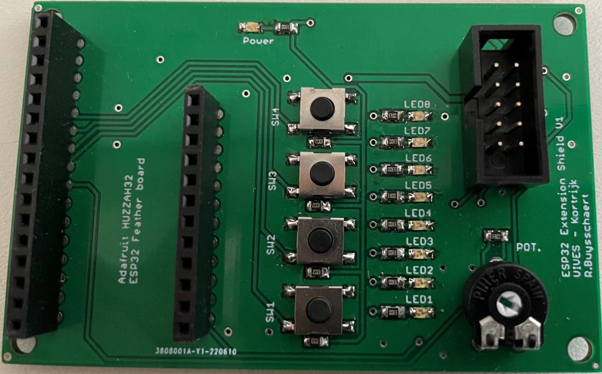
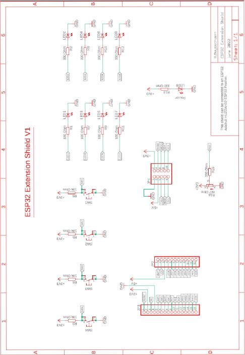

---
mathjax:
  presets: '\def\lr#1#2#3{\left#1#2\right#3}'
---

# De ESP32 Extension shield

Om het programmeren wat eenvoudiger te maken gaan we gebruik maken van een ESP32 shield.

De shield heeft 4 drukknoppen, 8 leds, een trimmer en een connector om SPI- en I2C componenten aan te sluiten. In de volgende tabel is weergegeven wat de naam en op welke IO-pin deze zijn aangesloten. De connector met de SPI en I²C aansluitingen zijn niet weergegeven maar deze kan een goede technicus uit het schema van de volgende figuur halen.

| Naam | IO-pin |
| ----------- |:------------:|
| SW1| 39 | 
| SW2| 34| 
| SW3| 25 | 
| SW4| 26 | 
| LED1| 21 | 
| LED2| 14 | 
| LED3| 32 | 
| LED4| 15 | 
| LED5| 33 | 
| LED6| 27 | 
| LED7| 12 | 
| LED8| 13 | 
| POT| A4 | 

[An Internal Link](src\guide\part10\shield.pdf){:target="_blank"} 

