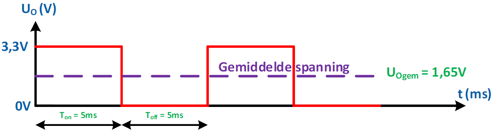
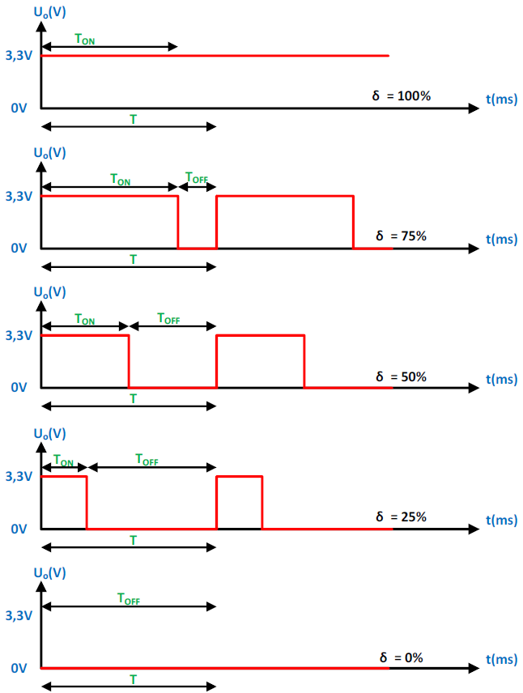
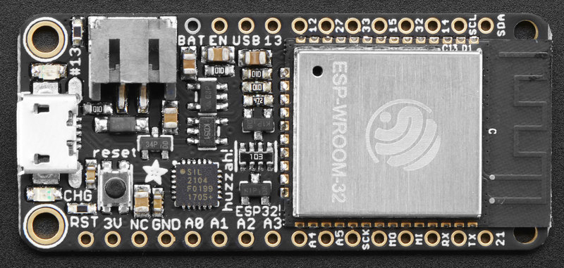
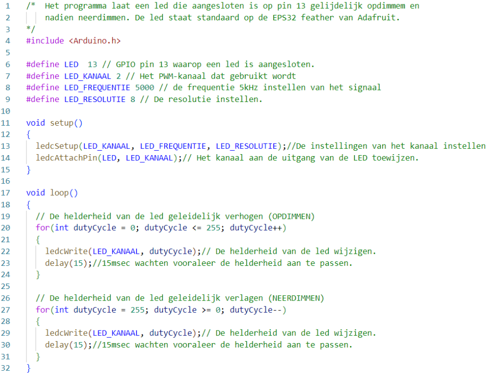
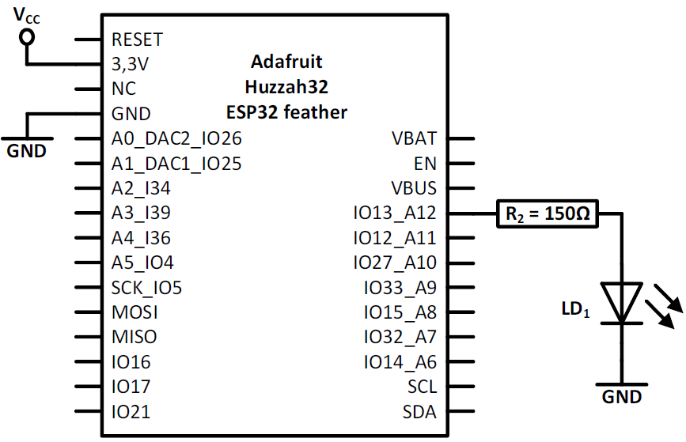
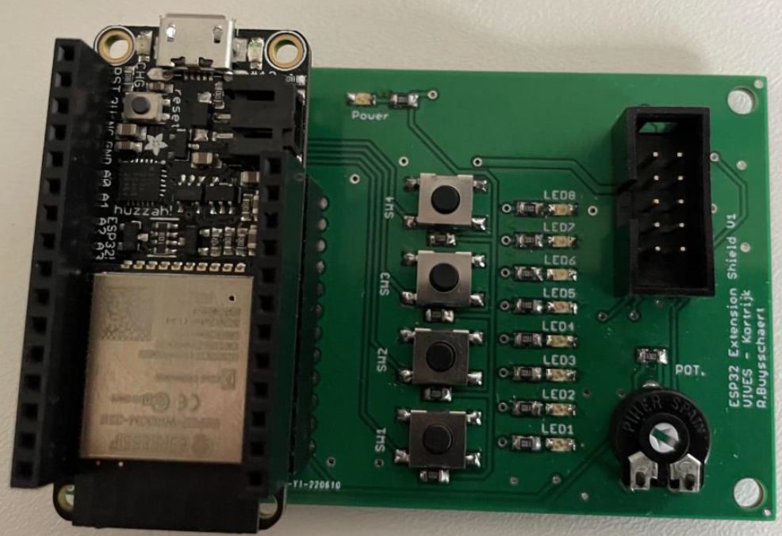

---
mathjax:
  presets: '\def\lr#1#2#3{\left#1#2\right#3}'
---

# PWM uitgangen

In dit hoofdstuk wordt uitgelegd wat PWM is en hoe je dit met de ESP32 kan verwezenlijken.

De ESP32 LED PWM-controller heeft 16 onafhankelijke kanalen die kunnen worden geconfigureerd om PWM-signalen met verschillende eigenschappen te genereren. Alle pinnen die als uitgangen kunnen dienen, kunnen worden gebruikt als PWM-pinnen (GPIO's 34 tot 39 kunnen geen PWM genereren). Hiervoor kan de AnalogWrite (Arduino) worden gebruikt of het ledc-statement (bezit meer mogelijkheden dan analogWrite).

## Werking PWM

PWM is de afkorting van Pulse With Modulation. In het Nederlands heet dit Puls breedte modulatie of beter puls breedte sturing.
Puls breedte modulatie is een eenvoudige methode om op een digitale uitgang een blokgolfspanning te voorzien om zo een semi-analoge spanning op de uitgang te krijgen.
In volgende figuur wordt de helft van de tijd de uitgang hoog gemaakt en de andere helft van de tijd de uitgang laag. Dit wil zeggen dat de gemiddelde spanning op de uitgang gelijk wordt aan de helft van de voedingsspanning. In volgende figuur is dit de helft van 3,3V gelijk aan 1,65V.



::: tip
Merk op dat de frequentie van dit signaal 100Hz is, want de periode is 10ms.
:::

Door de frequentie van de blokgolfspanning groot te nemen wordt dit bij het aansturen van verlichting door het menselijk oog niet gezien als een knipperende verlichting maar als een gedimde verlichting. Bij motoren zal dit ook niet leiden tot een schokkerig draaien maar als het trager draaien van de motor.

::: warning
Bij het gebruik van een PWM signaal zal de frequentie altijd constant blijven!!
:::

Men noemt de duty-cycle de verhouding van de aan-tijd van het signaal ten opzichte van de volledige tijd van de periode, uitgedrukt in procent.

$\delta = \frac{T_{on}} {T}.100\% $

Als je de duty-cycle vermenigvuldigd met de voedingsspanning dan bekom je de gemiddelde uitgangsspanning.

$Uo_{gem} = \delta.Uv $

PWM-besturing wordt gebruikt in een verscheidenheid aan toepassingen, variërend van communicatie tot automatische besturing. Het dimmen van ledverlichting tot het toerental regelen van een DC-motor, … .

De periode (=T) wordt normaal gesproken constant gehouden, en de puls breedte, of "aan" tijd (=Ton) wordt gevarieerd.

In volgende figuur zijn enkele voorbeelden van PWM-signalen getoond.



## PWM IO-pinnen op de huzzah32

Op alle GPIO pinnen die als uitgang gebruikt kunnen worden kan een PWM signaal gegenereerd worden, behalve pin 34, 39 en 36.





## De verschillende stappen om een PWM signaal te maken (methode1)

Er zijn twee manieren om een PWM signaal te genereren met een vast frequentie een instelbare duty-cycle. Hierbij worden twee verschillende statements gebruikt.
> - analogWrite(PIN, 255); //value range 0-255 so 255=100%
> - ledcWrite(channel, dutycycle)

We bespreken hier enkel de tweede methode.

De EPS32 heeft 16 onafhankelijke kanalen die ingesteld kunnen worden om PWM signalen tegenereren met verschillende eigenschappen.

De verschillende stappen die je moet doorlopen worden zijn:
> - PWM-kanaal kiezen: <br> Kies een PWM kanaal om te gebruiken. Er zijn er 16 met een nummer van 0 tot 15. Om het gemakkelijk te maken maak je gebruik van een constante en geef deze een duidelijke naam. Bijvoorbeeld:
```cpp
#define LED_KANAAL 2
```
> - PWM-frequentie bepalen: <br> Vervolgens stel je de frequentie in van het PWM signaal. Voor een LED te dimmen is een frequentie van 500Hz voldoende. Om het gemakkelijk te maken gebruik een constante die je een duidelijke naam geeft. Bijvoorbeeld:
```cpp
#define LED_FREQUENTIE 500
```
> - PWM-resolutie kiezen: <br> Stel dan de resolutie van de duty-cycle (=δ) van het PWM signaal in. Dit kan je instellen met een resolutie van 1 tot 16 bits. Voor het dimmen van een LED is 8 bit voldoende. Dit wil zeggen dat er 2<sup>8</sup> = 256 verschillende stappen zijn. Om het gemakkelijk te maken maak je gebruik van een constante die je een duidelijke naam geeft. Bijvoorbeeld:
```cpp
#define LED_RESOLUTIE 8
```
> - PWM-frequentie -en resolutie aan het kanaal toewijzen: <br> De gekozen frequentie en de resolutie moeten aan het gekozen kanaal toegewezen worden. Daarvoor gebruik je de methode:
```cpp
ledcSetup(channel, freq, resolution_bits);
```

De eerste parameter is het te gebruiken kanaal. De tweede parameter de frequentie en de laatste parameter de resolutie. In het voorbeeld van de led wordt dit:
```cpp
ledcSetup(LED_KANAAL, LED_FREQUENTIE, LED_RESOLUTIE);
```

> - Toewijzen uitgangspin aan het kanaal: <br> Als voorlaatste stel je in aan welke GPIO-pin je wil gebruiken om het PWM signaal naar buiten te brengen. Dit gebeurt met de methode:
```cpp
ledcAttachPin(pin, channel);
```
De eerste parameter is de GPIO uitgangspin waarop het PWM signaal komt te staan en de tweede parameter is het kanaal die je er aan toewijst. Bij het voorbeeld van de LED is dit:

```cpp
#define LED 13
ledcAttachPin(LED, channel);
```
> - Duty-cycle van het kanaal instellen: <br> Om vervolgens de duty-cycle te wijzigen wordt volgende methode gebruikt.
```cpp
uint32_t duty = 6;
ledcWrite(channel, duty);
```
De eerste parameter is het kanaal waarvan je de duty-cycle wil instellen. De volgende parameter is de duty-cycle. De waarde is afhankelijk van de ingestelde resolutie. Bij het voorbeeld van de led is de resolutie 8 bit. Dit wil zeggen dat er 2<sup>8</sup> =256 mogelijkheden zijn. De minimumwaarde is 0 en de maximumwaarde is 255.
```cpp
uint32_t duty_cycle = 127;
ledcWrite(LED_KANAAL, duty_cycle);
```

## Voorbeeldprogramma dimmen LED

Het voorbeeldprogramma laat een led geleidelijk opdimmen en nadien neerdimmen en dit in een oneindige lus.
De lijnen 1 tot en met drie geven meer info over het programma.
Op de lijnen 5 tot en met 9 worden allerlei constanten weergegeven die verder in het programma worden gebruikt.
De setup methode maakt alle instellingen van het PWM kanaal en wijst het kanaal toe aan een uitgangspin.
In de loopmethode wordt er een for-lus voorzien die de duty-cycle geleidelijk verhoogt op lijn 19 t.e.m. 24 en op lijn 26 t.e.m. 31 wordt de for-lus voorzien die de led laat neerdimmen.



## Hardware

Het schema van de PWM-uitgang is weergegeven en is dezelfde om een LED digitaal aan te sturen, met die uitzondering dat hier de LED dimbaar is.



***
<div style="background-color:darkgreen; text-align:left; vertical-align:left; padding:15px;">
<p style="color:lightgreen; margin:10px">
Opdracht: Vier drukknoppen die een PWM-uitgang besturen. Maak een programma waarbij de helderheid van de LED7 op de shield gedimd kan worden.
</p>
<ul>
<li style="color:white">Als op SW1 gedrukt wordt moet de led uit gaan.</li>
<li style="color:white">Als op SW2 gedrukt wordt moet de led op 33% van zijn volle lichtsterkte branden.</li>
<li style="color:white">Als op SW3 gedrukt wordt moet de led op 66% van zijn volle lichtsterkte branden.</li>
<li style="color:white">Als op SW4 gedrukt wordt moet de led op 100% van zijn volle lichtsterkte branden.</li>
</ul>
<p style="color:lightgreen; margin:10px">
Gebruik bij het dimmen een periode T van 10ms. Zorg voor prioriteit op helderheid.</p>
</div>



***
<div style="background-color:darkgreen; text-align:left; vertical-align:left; padding:15px;">
<p style="color:lightgreen; margin:10px">
Opdracht: Led dimmen met een trimmer. Maak een programma waarbij de helderheid van de LED4 op de shield gedimd kan worden.
</p>
</div>


