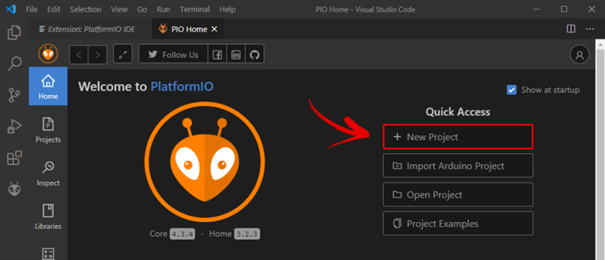
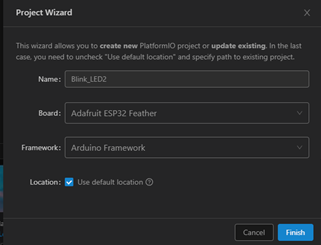
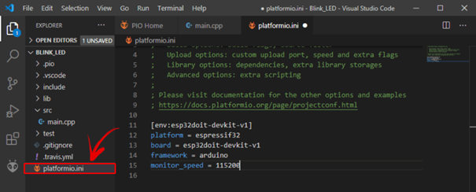
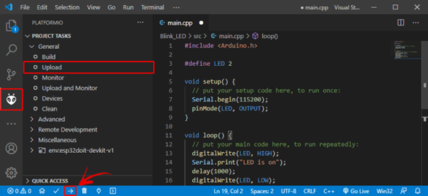

# Platform IDE Overview

Om nu met het geheel te werk te gaan (schrijven van code, compileren en uploaden naar de microcontroller) wordt nu vertrokken vanuit een klassiek voorbeeld om tot een knipperende LED te komen (blinking LED).

# Create a New Project

in VSC, klik op het icoon van PIO en klik op New Project om een nieuw project te starten:



Geef het project een goeie naam: vb. : "Blink_LED" en selecteer de juiste microcontroller board. Het Arduino Framework wordt gebruikt om de Arduino-code te compileren naar binaire code die in de esp32 microcontroller kan worden geprogrammeerd.

Let op de locatie van uw project binnen de mappenstructuur van uw computer. Gebruik hiervoor logische sructuren zodat je later uw projecten kan terug vinden!!

De standaard locatie staat nu ingesteld op het pad : Documents >PlatformIO >Projects 



Klik "Finish".

Er wordt een nieuw project toegevoegd aan de Workspace. Open platformio.ini en voeg toe:


VS Code en PlatformIO hebben een mappenstructuur die verschilt van het standaard .ino-project. Als u op het tabblad Verkenner klikt, ziet u alle bestanden die het heeft gemaakt in uw projectmap. Het lijkt misschien veel bestanden om mee te werken. Maar maak je geen zorgen, meestal hoef je alleen maar met een of twee van die bestanden om te gaan.

> **Warning**
> Let op, je verwijdert, wijzigt of verplaatst best die bestanden niet. Anders kunt u uw project niet meer compileren met PlatformIO.

**platformio.ini file**

Het platformio.ini-bestand is het PlatformIO-configuratiebestand voor uw project. Het toont het platform, het bord en het raamwerk (framework) voor uw project. U kunt ook andere configuraties toevoegen, zoals bibliotheken die moeten worden opgenomen, uploadopties, het wijzigen van de baudrate van de seriële monitor en andere configuraties.



Met volgende:

> * platform: welke gebruikte microcontroller (SoC).
> * board: het type ontwikkel-board
> * framework: het software ontwikkel platform die de code zal compileren

Voor de ESP32 en ESP8266, wordt de gebruikte datasnelheid voor de seriëele communicatie ingesteld op een baud rate van 115200. Dit doe je door de platformio.ini file (zoals volgnde figuur) aan te passen (Klik na aanpassen op Ctrl+S om wijziging op te slaan). In dit bestand kun je ook de identifier opnemen van bibliotheken die je in je project gaat gebruiken met behulp van de lib_deps-richtlijn.

**src folder**

De src-map is uw werkmap. Onder de src-map bevindt zich een main.cpp-bestand. Daar schrijf je je code. Klik op dat bestand. De structuur van een Arduino-programma zou moeten openen met de functies setup() en loop().


In PlatformIO moeten alle Arduino sketches (een project wordt in de Arduino een sketch genoemd) bovenaan in de code straten met het aanroepen van de Arduino bibliotheek door volgend statement **#include <Arduino.h>**.

# Uploading Code met PlatformIO IDE: ESP32/ESP8266

Schrijf volgende code in de main.cpp

```cpp
#include <Arduino.h>

#define LED 13

void setup() {
  // put your setup code here, to run once:
  Serial.begin(115200);
  pinMode(LED, OUTPUT);
}

void loop() {
  // put your main code here, to run repeatedly:
  digitalWrite(LED, HIGH);
  Serial.println("LED is on");
  delay(1000);
  digitalWrite(LED, LOW);
  Serial.println("LED is off");
  delay(1000);
}
```

Nu kunt u op het pictogram Uploaden klikken om de code te compileren en te uploaden. U kunt ook naar het menu PIO-projecttaken gaan en Uploaden selecteren.



Als de code successvol is geuploaded, dan wordt volgend bericht weergegeven.


Klik nu op het pictogram van de seriële monitor en u zou de huidige LED-status moeten zien afdrukken.

