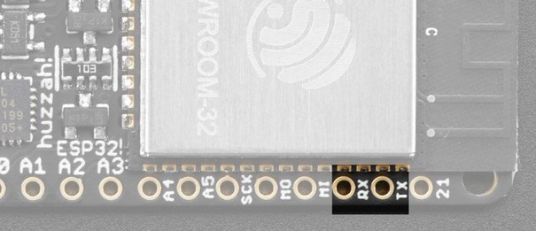

# Pin layout van de esp32

Een van de geweldige dingen van de ESP32 is dat hij tonnen meer GPIO heeft dan de ESP8266. U hoeft niet te jongleren of te multiplexen met uw IO-pinnen! Er zijn een paar dingen om op te letten, dus lees de pin-outs zorgvuldig door.

Met de onderkant : 

## Power pins

> * **GND** - dit is de gemeenschappelijke nul-volt (referentie) voor alle voeding en logica.
> * **BAT** - dit is de positieve spanning van/naar de JST-aansluiting voor de optionele Lipoly-batterij.
> * **USB** - dit is de positieve spanning van/naar de micro-USB-aansluiting indien aangesloten.
> * **EN** - dit is de activeringspin van de 3.3V-regelaar. Het is omhoog getrokken (pulled-up), dus maak verbinding met aarde om de 3.3V-regelaar uit te schakelen.
> * **3V** - dit is de output van de 3.3V-regelaar. De regelaar kan een piek van 500 mA leveren, maar de helft daarvan wordt getrokken door de ESP32, en het is een behoorlijk stroomverslindende chip. Dus als je veel stroom nodig hebt voor dingen zoals LED's, motoren, enz. Gebruik dan de USB- of BAT-pinnen en een extra regelaar.

## Logische (digitale) pinnen : GPIO

Dit is de algemene I/O-pinset voor de microcontroller. Alle logica is 3.3V!!

> **Warning**
> De ESP32 werkt op 3,3V  : tenzij anders aangegeven, zijn GPIO-pinnen niet 5V veilig (no 5V tolerant)!.

## Serial pins

RX en TX zijn de extra Serial-pinnen en zijn niet aangesloten op de USB/Serial-converter. Dat betekent dat je ze kunt gebruiken om verbinding te maken met UART-apparaten zoals GPS's, vingerafdruksensoren, enz.

De TX-pin is de uitgang van de module. De RX-pin is de ingang in de module. Beide zijn 3.3V logica.

## I²C & SPI pins

Je kunt de ESP32 gebruiken om I2C- en SPI-apparaten, sensoren, uitgangen, enz. te besturen. Bij gebruik met Arduino werken de standaard Wire- en SPI-apparaten zoals je zou verwachten!

Merk op dat de I2C-pinnen nog geen pullup-weerstanden hebben! Je moet ze toevoegen als je wilt communiceren met een I2C-apparaat.

## GPIO & analoge pins

Er zijn talloze GPIO- en analoge ingangen beschikbaar voor het aansluiten van LED's, knoppen, schakelaars, sensoren, enz. Hiervoor zijn de resterende pinnen beschikbaar.

Bottom row:
> * **A0** - dit is een analoge ingang A0 en ook een analoge uitgang DAC2. Het kan ook worden gebruikt als een GPIO #26. Het gebruikt ADC #2.
> * **A1** - dit is een analoge ingang A1 en ook een analoge uitgang DAC1. Het kan ook worden gebruikt als een GPIO #25. Het gebruikt ADC #2.
> * **A2** - dit is een analoge ingang A2. Het kan ook worden gebruikt als een GPI #34. Het gebruikt ADC #1. Deze pin kan GEEN Output zijn.
> * **A3** - dit is een analoge ingang A3. Het kan ook worden gebruikt als een GPI #39. Het gebruikt ADC #1. Deze pin kan GEEN Output zijn.
> * **A4** - dit is een analoge ingang A4. Het kan ook worden gebruikt als een GPI #36. Het gebruikt ADC #1. Deze pin kan GEEN Output zijn.
> * **A5** - dit is een analoge ingang A5. Het kan ook worden gebruikt als een GPIO #4. Het gebruikt ADC #2.
> * **21** - dit is een GPIO #21.  

Top row:
> * **13** - dit is een analoge ingang A12. Het kan ook worden gebruikt als een GPIO #13. Het gebruikt ADC #2. Deze pin is ook verbonden met de rode LED naast de USB connector.
> * **12** - dit is een analoge ingang A11. Het kan ook worden gebruikt als een GPIO #12. Het gebruikt ADC #2. Deze pin bezit inwendig een pull-down weerstand. Er wordt geadviseerd om deze pin enkel te gebruiken als Output of er zeker van te zijn dat tijdens het boot-proces de pull-down geen afeect veroorzaakt.
> * **27** - dit is een analoge ingang A10. Het kan ook worden gebruikt als een GPIO #27. Het gebruikt ADC #2. 
> * **33** - dit is een analoge ingang A9. Het kan ook worden gebruikt als een GPIO #33. Het gebruikt ADC #1. Het kan ook gebruikt worden als aansluiting van een 32Khz kristaloscillator.
> * **15** - dit is een analoge ingang A8. Het kan ook worden gebruikt als een GPIO #15. Het gebruikt ADC #2.
> * **32** - dit is een analoge ingang A7. Het kan ook worden gebruikt als een GPIO #32. Het gebruikt ADC #1. Het kan ook gebruikt worden als aansluiting van een 32Khz kristaloscillator.
> * **14** - dit is een analoge ingang A6. Het kan ook worden gebruikt als een GPIO #14. Het gebruikt ADC #2. 

Er is nog een externe analoge input:

> * **A13** - dit is een GPI #35 en kan gebruikt worden als analoge input A13. Deze pin bevat een weerstandsdeling die is aangesloten op de VBAT lijn. Op die manier kan de toestand van de batterij worden ingelezen op deze pin.

> **Warning**
> Houd er rekening mee dat u alleen analoge ingangen op ADC #2 kunt lezen zodra WiFi is gestart, omdat deze wordt gedeeld met de WiFi-module.