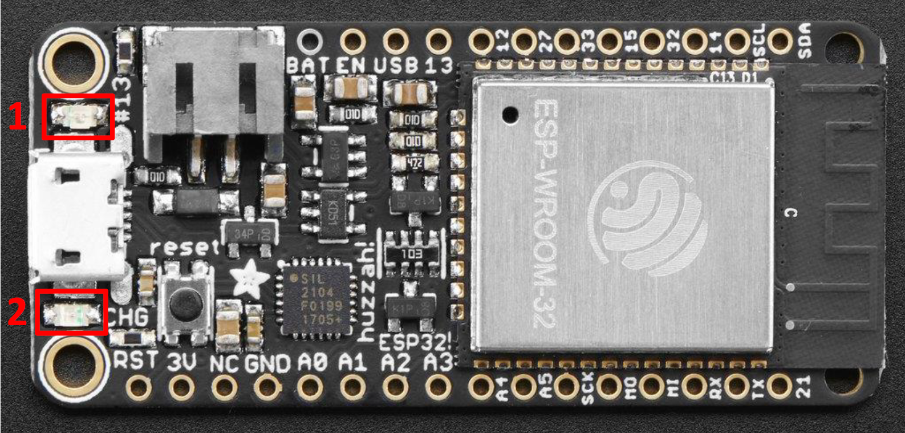

---
mathjax:
  presets: '\def\lr#1#2#3{\left#1#2\right#3}'
---

# GPIO

De esp32 bezit dus een aantal GPIO (General Purpose Input Output) pinnen. Deze pinnen kunnen gebruikt worden als digitale in- of output. Bij een input kan een digitale toestand (0 of 1) worden gelezen door de microcontroller. 


> - Een ingang zal gebruikt worden om door de microcontroller te worden gelezen, hierop zal dus één of andere vorm van sensor of detector worden aangesloten. Meest eenvoudige vorm van zoiets is een drukknop.
> - Een uitgang zal gebruikt worden om door de microcontroller te worden aangestuurd, hierop zal dus één of andere vorm van actuator worden aangesloten. Meest eenvoudige vorm van zoiets is een LED.

## Digitale uitgangen

Een kan dus als een uitgang (output) worden ingesteld in de software. Hierdoor kan de software dan die pin logisch 0 of logisch 1 aansturen. 

> - Wanneer een ouput pin logisch 0 is, dan zal de spanning die op die pin aanwezig is, 0V zijn.
> - Wanneer een ouput pin logisch 1 is, dan zal de spanning die op die pin aanwezig is, 3,3V zijn (= voedingsspanning van de microcontroller).

In digitale systemen worden een aantal termen door elkaar gebruikt om te zeggen dat een toestel **aan** of **uit** staat. Deze verschillende termen worden weergegeven in de volgende tabel.


| 0V | 3,3V |
| ----------- |:------------:|
| Open        | Closed    | 
| Off    | On           | 
| Low  | High   |
| Clear  | Set   |
| Logic 0  | Logic 1   |
| False  | True  |


De termen ‘logisch 0’ en ‘logisch 1’ worden meestal afgekort naar ‘0’ en ‘1’.

## Digitale uitgangspinnen van de EPS32 feather van Adafruit

Wij gebruiken de huzzah32 feather van Adafruit zoals in volgende figuur is weergegeven.


Enkel de pinnen met de gele labels zoals in bovenste figuur kunnen als digitale uitgangen gebruikt worden, behalve pin 34, 39 en 36 niet. Het maximum aantal is dus 18.

***

Het ontwikkelbord heeft 2 leds aanwezig waarbij de led boven de USB-connecter en naast de aansluiting van de battreij verbonden is met IO-pin 13. Deze kunnen we aansturen van uit de code en kan ingesteld worden als uitgang (1).
De led onder de USB-connector (2) knippert vanaf dat er voedingsspanning aanwezig is.



::: warning 
Zorg er altijd voor dat je geen actoren rechtstreeks op een IO-pin van de ESP32 aansluit die een stroom moet sourcen (leveren) die hoger is dan 40mA of een stroom moet sinken (afleiden naar massa) die hoger is dan 20mA.
:::

## pinMode

Als men een IO-pin als uitgang wil gebruiken moet men de pinMode van de IO-pin instellen als uitgang zoals in volgende figuur. Het is het gemakkelijkst om hier de gele pinbenaming te gebruiken zoals in bovenste figuur.
De pinMode van de IO-pin stel je in bij opstart van de controller en dit gebeurt in de setup-methode (instructie moet slechts één keer worden uitgevoerd, vanaf dan weet de µC dat deze pin een OUTPUT is).
Aan de functie *pinMode* worden er twee parameters meegegeven tussen haakjes. De eerste parameter is de IO-pin waarover het gaat en de tweede parameter is hoe deze ingesteld moet worden, hier is dit als uitgang. De instructie wordt afgesloten met een puntkomma.

```cpp
void setup()
{
    pinMode(13, OUTPUT);
}
```

Een goede programmeur zal een duidelijker naam willen voor de uitgang en zo weinig mogelijk gebruik maken van de IO-nummers. Daarom gaat men gebruik maken van constanten. De constanten declareert men voor de setup routine in het begin van het programma.
Op lijn 3 is te zien dat de constante de naam ‘LED’ heeft en dat er 13 wordt toegewezen. ‘# define’ geeft weer dat LED gelijk staat aan 13. In de code wordt bij het compileren overal LED vervangen door 13.

```cpp
# define LED 13
void setup()
{
    pinMode(LED, OUTPUT);
}
```

## digitalWrite

Een digitale uitgang kan twee waarden aannemen. In de volgende figuur zijn een aantal mogelijkheden om een digitale uitgang een waarde de te geven.
Als de uitgang laag, 0 of als false wordt ingesteld, dan wordt er een 0V spanning op de desbetreffende pin geplaatst (door de inwendige elektronica van de µC).
Als de uitgang hoog, 1 of als true wordt ingesteld dan wordt er een spanning gelijk aan de voedingsspanning op de pin geplaatst. Bij de EPS32 is dit een spanning van 3,3V.
De methode digitalWrite heeft twee parameters die moeten worden meegegeven tussen haakjes. De eerste parameter is de IO-pin waarover het gaat. Hier is dit *LED* die aangesloten is op IO-pin 13. De tweede parameter is de waarde van de uitgang. Bijvoorbeeld LOW, HIGH, … . De instructie wordt afgesloten met een puntkomma.

```cpp
# define LED 13
void setup()
{
    pinMode(LED, OUTPUT);
}
void loop()
{
    //Mogelijkheid om een uitgang laag te maken
    digitalWrite(LED, LOW);
    digitalWrite(LED, false);
    digitalWrite(LED, 0);
    //Mogelijkheid om een uitgang hoog te maken
    digitalWrite(LED, HIGH);
    digitalWrite(LED, true);
    digitalWrite(LED, 1);
}
```

Natuurlijk is bovenstaand programma onzinnig omdat er drie keer na elkaar wordt gecommandeerd dat de uitgang LAAG moet worden gezet. Eén keer is voldoende om de uitgang LAAG te zetten, en dit blijft zo tot het anders wordt gecommandeerd.

::: details
Het commando "digitalRead", wat normaal gebruikt wordt bij een digitale input (zie later), kan eigenaardig ook gebruikt worden bij een digitale output. Hierdoor kan volgend programma werken.
:::

```cpp
# define LED 13
void setup()
{
    pinMode(LED, OUTPUT);
}
void loop()
{
    digitalWrite(LED, !(digitalRead(LED)));
    delay(1000);
}
```
Het uitroepteken wordt bij logische operatoren gebruikt om de digitale toestand te inverteren (0 wordt 1 en/of 1 wordt 0).


***

De meest eenvoudige actuator die kan aangestuurd worden met een digitale ouput pin is een LED.

Een LED is een diode met twee aansluitklemmen (Anode en Kathode). Een  LED zal licht afgeven bij volgende voorwaarden:
> - Anode staat op een positief niveau tov de anode (ongeveer 1,5V) 
> - De stroom die van Anode naar Kathode vloeit is ongeveer 20mA.  

Voor detail bij een specifieke LED, zoek in datasheet van die LED naar Uf en If.

Door deze twee waarden is het noodzakelijk om een weerstand in serie te plaatsen met de LED.

We kunnen een LED extern plaatsen en aansturen door gebruik te maken van een breadboard.

Op een breadboard kan dan via draadjes verbindingen en schakelingen worden gebouwd. 


De doorverbindingen van het breadboard ziet er als volgt uit:


## Aansluiten van een led (hardware)

De meeste standaard leds hebben een werkspanning lager dan 3,3V. Als we de led rechtstreeks aansluiten op de microcontroller zal door de te hoge spanning de stroom door de led te groot worden en zal dit de led beschadigen. In het slechtste geval is de led direct defect.
Als de stroom groter zal zijn dan 40mA bij de ESP32, dan zal de uitgang van de controller ook beschadigd worden.

Het schema is te zien in de volgende figuur. In het schema wordt er een weerstand gebruikt van 220Ω.
Gemiddeld staat er over een rode led een spanning van ongeveer 1,6V. Dits wil zeggen dat er over de weerstand een spanning staat van:

Euler's identity $e^{i\pi}+1=0$ is a beautiful formula in $\mathbb{R}^2$.

$U_R=𝑉𝑜𝑒𝑑𝑖𝑛𝑔𝑠𝑠𝑝𝑎𝑛𝑛𝑖𝑛𝑔−𝑈_{LED}=3,3V-1,6V=1,7V$

De stroom door de weerstand is dan:
$I = \frac{U_R} {R} = \frac{1,7V} {220\Omega}$


### Een verkeerslicht bouwen

Om een verkeerslicht te maken worden de drie uitgangen van de Micro:Bit gebruikt.


Bij het bouwen van de schakeling moet je weten dat een led een positieve aansluiting (=anode)
heeft en een negatieve aansluiting (=kathode). De Anode moet verbonden worden met de weerstanden.
De aansluiting van de anode is langer dan de aansluiting van de kathode.
De weerstanden hebben een waarde van 150Ω (=150 Ohm), 120Ω en 39Ω. Dit kan je zien aan de 4
gekleurde bandjes waarvan de eerste drie banden de waarde voorstellen.
De weerstandswaarde van de weerstand verbonden met de rode led is 150Ω (bruin, groen, bruin).
De weerstandswaarde van de weerstand verbonden met de gele led is 39Ω (oranje, wit, zwart).
De weerstandswaarde van de weerstand verbonden met de groene led is 120Ω (bruin, rood, bruin).

De python code om een knipperled te programmeren ziet er als volgt uit (hier is de externe LED is aangesloten op pin1):

## Digitale input

> - Een logische 0 wordt op een digitale input gelezen als er op die pin een spanning wordt aangeboden van 0V.
> - Een logische 1 wordt op een digitale input gelezen als er op die pin een spanning wordt aangeboden van 3,3V (= voedingsspanning van de microcontroller)

De eenvoudigste hardware detector die kan gebruikt worden om een digitale input aan te sturen is een drukknop. Bedienen kan door het indrukken of het loslaten van de drukknop. Een drukknop is geen schakelaar. Een schakelaar kent twee rusttoestanden, een drukknop slechts één.

Een drukknop werkt op het principe van het 'maken van een contact' of 'het verbreken van een contact tussen twee aansluitpunten. Soms spreekt men van een NO-contact of een NC-contact. Meestal wordt als drukknop een NO-contact gebruikt. Bij het drukken worden een verbinding gemaakt, bij loslaten wordt een verbinding verbroken, tussen twee aansluitpunten.


## PWM
De ESP32 LED PWM-controller heeft 16 onafhankelijke kanalen die kunnen worden geconfigureerd om PWM-signalen met verschillende eigenschappen te genereren. Alle pinnen die als uitgangen kunnen dienen, kunnen worden gebruikt als PWM-pinnen (GPIO's 34 tot 39 kunnen geen PWM genereren). Hiervoor kan de AnalogWrite (Arduino) worden gebruikt of het ledc-statement (bezit meer mogelijkheden dan analogWrite).