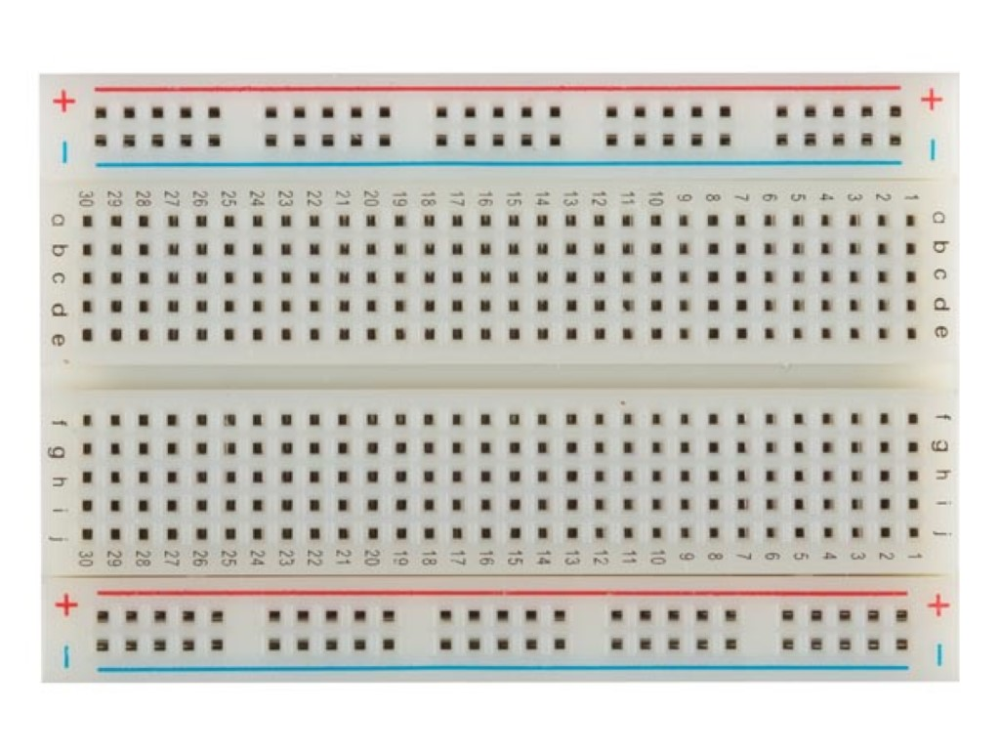

# GPIO

De esp32 bezit dus een aantal GPIO (General Purpose Input Output) pinnen. Deze pinnen kunnen gebruikt worden als digitale in- of output. Bij een input kan een digitale toestand (0 of 1) worden gelezen door de microcontroller. 

> - Een ingang zal gebruikt worden om door de microcontroller te worden gelezen, hierop zal dus één of andere vorm van sensor of detector worden aangesloten. Meest eenvoudige vorm van zoiets is een drukknop.
> - Een uitgang zal gebruikt worden om door de microcontroller te worden aangestuurd, hierop zal dus één of andere vorm van actuator worden aangesloten. Meest eenvoudige vorm van zoiets is een LED.

## Digitale uitgangen

Een kan dus als een uitgang (output) worden ingesteld in de software. Hierdoor kan de software dan die pin logisch 0 of logisch 1 aansturen. 

> - Wanneer een ouput pin logisch 0 is, dan zal de spanning die op die pin aanwezig is, 0V zijn.
> - Wanneer een ouput pin logisch 1 is, dan zal de spanning die op die pin aanwezig is, 3,3V zijn (= voedingsspanning van de microcontroller).

In digitale systemen worden een aantal termen door elkaar gebruikt om te zeggen dat een toestel aan of uit staat. Deze verschillende termen worden weergegeven in de volgende tabel.

<b>Tip:</b> Use blue boxes (alert-info) for tips and notes. 
If it’s a note, you don’t have to include the word “Note”.

| 0V | 3,3V |
| ----------- |:------------:|
| Open        | Closed    | 
| Off    | On           | 
| Low  | High   |
| Clear  | Set   |
| Logic 0  | Logic 1   |
| False  | True  |

De meest eenvoudige actuator die kan aangestuurd worden met een digitale ouput pin is een LED.

Een LED is een diode met twee aansluitklemmen (Anode en Kathode) .

Op een breadboard kan dan via draadjes verbindingen en schakelingen worden gebouwd. 

De doorverbindingen van het breadboard ziet er als volgt uit:

### Een verkeerslicht bouwen

Om een verkeerslicht te maken worden de drie uitgangen van de Micro:Bit gebruikt.

Bij het bouwen van de schakeling moet je weten dat een led een positieve aansluiting (=anode)
heeft en een negatieve aansluiting (=kathode). De Anode moet verbonden worden met de weerstanden.
De aansluiting van de anode is langer dan de aansluiting van de kathode.
De weerstanden hebben een waarde van 150Ω (=150 Ohm), 120Ω en 39Ω. Dit kan je zien aan de 4
gekleurde bandjes waarvan de eerste drie banden de waarde voorstellen.
De weerstandswaarde van de weerstand verbonden met de rode led is 150Ω (bruin, groen, bruin).
De weerstandswaarde van de weerstand verbonden met de gele led is 39Ω (oranje, wit, zwart).
De weerstandswaarde van de weerstand verbonden met de groene led is 120Ω (bruin, rood, bruin).

De python code om een knipperled te programmeren ziet er als volgt uit (hier is de externe LED is aangesloten op pin1):

## Digitale input

> - Een logische 0 wordt op een digitale input gelezen als er op die pin een spanning wordt aangeboden van 0V.
> - Een logische 1 wordt op een digitale input gelezen als er op die pin een spanning wordt aangeboden van 3,3V (= voedingsspanning van de microcontroller)

De eenvoudigste hardware detector die kan gebruikt worden om een digitale input aan te sturen is een drukknop. Bedienen kan door het indrukken of het loslaten van de drukknop. Een drukknop is geen schakelaar. Een schakelaar kent twee rusttoestanden, een drukknop slechts één.

Een drukknop werkt op het principe van het 'maken van een contact' of 'het verbreken van een contact tussen twee aansluitpunten. Soms spreekt men van een NO-contact of een NC-contact. Meestal wordt als drukknop een NO-contact gebruikt. Bij het drukken worden een verbinding gemaakt, bij loslaten wordt een verbinding verbroken, tussen twee aansluitpunten.

## PWM
De ESP32 LED PWM-controller heeft 16 onafhankelijke kanalen die kunnen worden geconfigureerd om PWM-signalen met verschillende eigenschappen te genereren. Alle pinnen die als uitgangen kunnen dienen, kunnen worden gebruikt als PWM-pinnen (GPIO's 34 tot 39 kunnen geen PWM genereren). Hiervoor kan de AnalogWrite (Arduino) worden gebruikt of het ledc-statement (bezit meer mogelijkheden dan analogWrite).