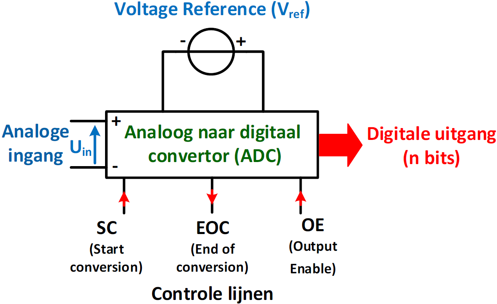
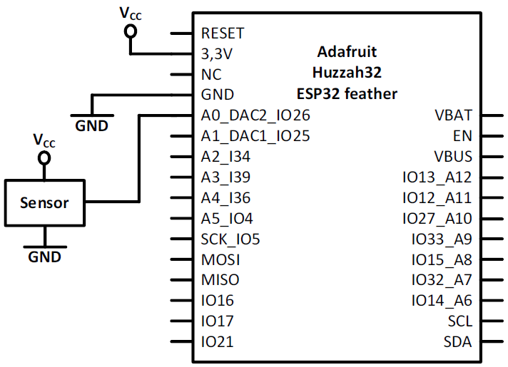
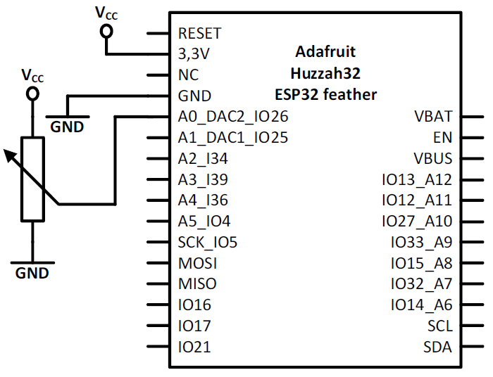

---
mathjax:
  presets: '\def\lr#1#2#3{\left#1#2\right#3}'
---

# Analoge ingangen

Microcontrollers worden vaak gebruikt als interface om analoge signalen om te zetten naar een digitale waarde.
Zij moeten in staat zijn om analoge ingangssignalen, bijvoorbeeld van een microfoon of temperatuursensor, om te zetten in digitale gegevens.
In deze bundel wordt uitgelegd hoe een analoge ingang moet aangesloten worden bij de Adafruit ESP32 feather.

## Analoge ingangspinnen van de ESP32 feather van Adafruit


Enkel de pinnen met de groene labels zoals in de eerste figuur kunnen als analoge ingangen gebruikt worden. Behalve pin 13 is een analoge ingang die verbonden is met een weerstandsdeler die
verbonden is met VBAT. Deze wordt gebruikt om de batterijspanning te kunnen meten.
De benaming van de analoge ingangen gaat van A0 tot en met A12.
Als je gebruik maakt van wifi kan enkel de analoge ingangen gebruikt worden die gebruik maken van ADC2. Dit wil zeggen dat je enkel A0, A1, A5, A6, A8, A10, A11 en A12 kan gebruiken als men wifi gebruikt.

## Principe en werking van een ADC

Een analoog naar digitaal convertor (ADC) is een elektronische schakeling waarvan de waarde van de uitgang recht evenredig is met het analoge ingangssignaal.
De ADC meet de ingangsspanning en geeft een binaire waarde aan de uitgang evenredig met de ingangsspanning.
Het ingangsbereik van de ADC wordt bepaald door een referentie spanning (Vref). Bij de meeste controllers wordt hier de voedingsspanning gebruikt.



De conversie wordt gestart door de digitale ingang SC (Start conversion) hoog te maken.
De conversie duurt een tijdje. Als de conversie volbracht is wordt de digitale EOC (End of conversion) uitgang hoog gemaakt.
Vanaf dat de digitale ingang OE (Output Enable) hoog gemaakt wordt zal de digitale waarde op een data-bus worden geplaatst.

In de volgende figuur wordt er een 3 bit conversie gedaan van het analoog signaal. Men krijgt hier de typische trapfunctie met hier 8 treden. Met 3 bit verdeelt men het bereik in 23 = 8 stappen.


De hoogste digitale waarde aan de uitgang komt overeen met de referentiespanning, die de maximum spanning is aan de ingang.

### Resolutie en afwijking.

Door een analoog signaal om te zetten in een digitaal signaal benaderen we bijna het werkelijk verloop, aangezien elke digitale uitgangswaarde een zeer klein bereik van analoge ingangsspanningen moet vertegenwoordigen, d.w.z. de breedte van een van de treden op de ‘trap’ n.

Als we een analoog signaal met een bereik van 0V tot 3,3V willen omzetten naar een 8-bits digitaal
signaal, dan zijn er 256 (d.w.z. 2<sup>8</sup>) verschillende uitgangswaarden. Elke trap heeft een breedte van:

$I = \frac{3,3V} {256} = 12,89mV$

De grootste afwijking is de helft van één stap, dus: 

$I = \frac{12,89mV} {2} = 6,45mV$

De ESP32 feather van Adafruit gebruikt een 12 bits ADC. Dit leidt tot een stapbreedte van:

$I = \frac{3,3V} {2^{12}} = 800µV$

De grootste afwijking is de helft van één stap, dus: 

$I = \frac{800µV} {2} = 400µV$

### Sampling frequentie

Bij het omzetten van een analoog signaal naar digitaal signalen nemen we herhaaldelijk een 'sample' en kwantificeren dit tot de nauwkeurigheid die de resolutie van onze ADC aangeeft.
Hoe meer monsters er worden genomen, hoe nauwkeuriger de digitale gegevens zijn. Monsters of samples worden normaal gesproken op vaste tijdstippen genomen (d.w.z. bv. om de 0,2 ms) en bepalen de bemonsteringsfrequentie (het aantal monsters dat per seconde wordt genomen).
De bemonsteringsfrequentie moet worden gekozen in verhouding tot de snelheid waarmee de bemonsterde gegevens veranderen. Als de samplefrequentie te laag is, is het mogelijk dat snelle veranderingen in het analoge signaal niet duidelijk zijn in het resulterende digitale signaal.
Daarom stelt het Nyquist-bemonsteringscriterium dat de bemonsteringsfrequentie ten minste het dubbele moet zijn van de hoogste frequentie van het ingangssignaal.


## AnalogRead

Om een analoge ingang te gebruiken hoeft men niet zoals een digitale in -of uitgang te zeggen hoe men de pin wil gebruiken. Om een analoge spanning om te zetten naar een integer moet men enkel de methode AnalogRead gebruiken.
Op lijn 11 is een constante POTENTIOMETER gedefinieerd met de waarde A0. Dit wil zeggen dat bij het compilen overal waar POTENTIOMETER staat deze vervangen wordt door A0.
Op lijn 18 wordt de analoge spanning op de pin waar de POTENTIOMETER (=A0) mee verbonden is op de ESP32 die zich bevindt tussen 0V en 3,3V omgezet wordt naar een getal tussen 0 en 4095.
Dit getal wordt in de integer variabele intPotValue geplaatst.

```cpp
void loop()
{
  //Lezen van de analoge spanning op de pin waar de potentiometer is aangesloten.
  //De analoge waarde wordt omgezet naar een getal tussen 0 en 4096 en 
  //wordt in de integervariabee intPotValue geplaatst.
  int intPotValue = analogRead(POTENTIOMETER);
}
```

## Aansluiten van een analoge spanning aan een analoge ingang.

De meeste analoge sensoren zullen een voedingspanning nodig hebben. In de volgende figuur is dit Vcc met namelijk de waarde 3,3V. Natuurlijk niet te vergeten moet de GND aangesloten worden. Hoe een analoge senor moet aangesloten worden staat ook in de manual van de sensor.
De sensor heeft natuurlijk ook een uitgang waarop de sensor een spanning zal plaatsen die niet hoger mag zijn dan de 3,3V van de ESP32.



In de volgende figuur is een potentiometer aangesloten op de analoge ingang A0 van de ESP32. Bij een potentiometer wordt de loper aangesloten op de ingang. Aan de andere aansluitingen wordt de voedingsspanning (3,3V) en de GND aangesloten.



::: warning
Let op de waarde van de potentiometer. Neem deze niet te klein!! Ergens tussen 4k7 en 15k is ok. Weet je ook waarom?
:::